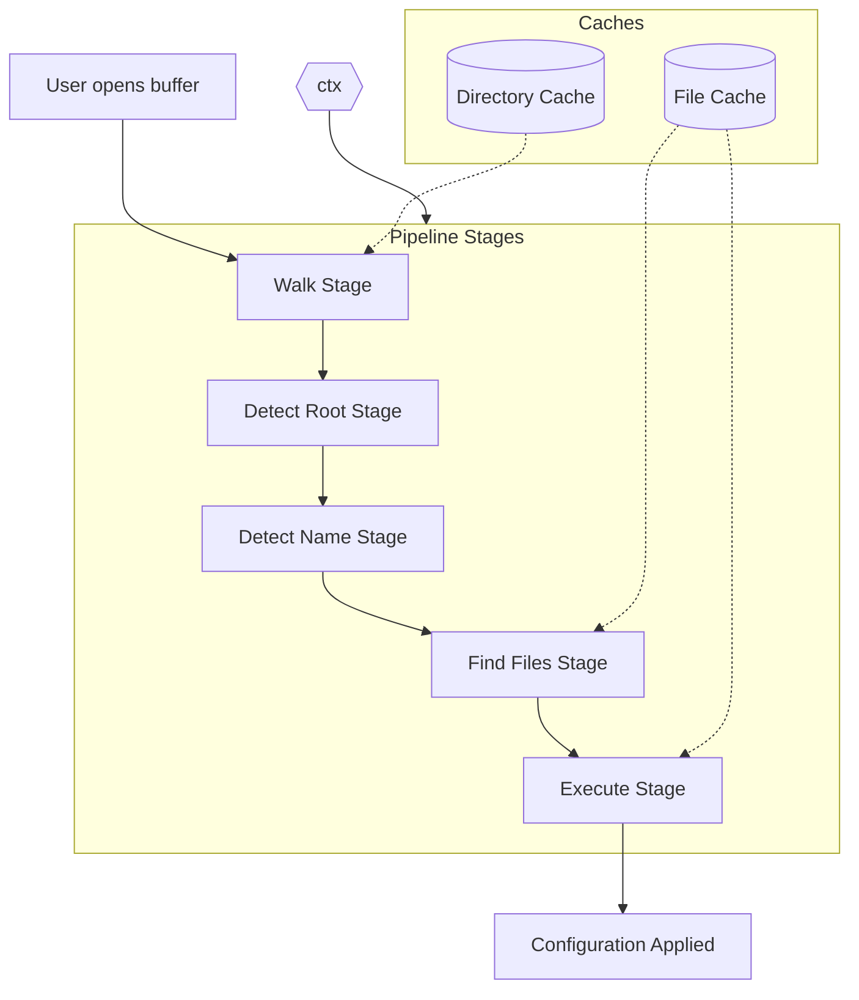
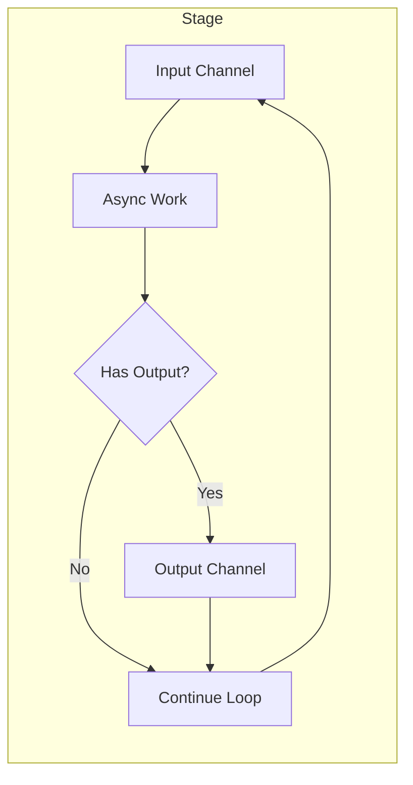
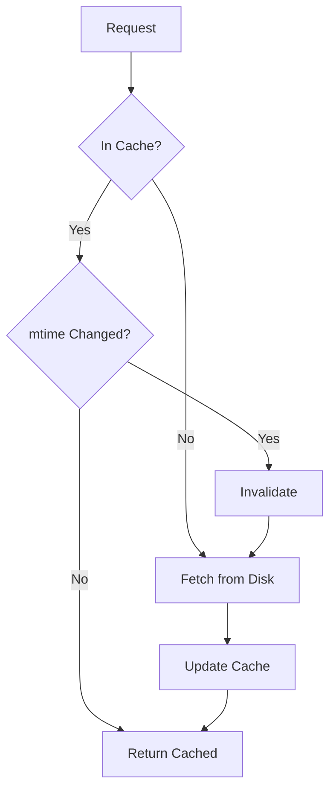

# nvim-project-config

> Per-project configuration for Neovim with smart detection, flexible loading, and seamless integration.

## Introduction

Every project is different. Your Neovim configuration should adapt to the project you're working on, not fight against it. `nvim-project-config` automatically detects which project you're in and loads the appropriate configuration—whether that's project-specific settings, keymaps, or tooling preferences.

This library provides a robust, asynchronous pipeline for project detection and configuration loading. It walks your directory tree, identifies project roots using configurable matchers, finds configuration files in your Neovim config directory, and executes them using pluggable handlers for Lua, Vim script, and JSON.

## Architecture Overview



The system operates through a **configurable pipeline** with pluggable stages:

1. **Walk**: Traverses directories upward from current file, yielding each as a potential project
2. **Detect** (root): Identifies the project root using matchers (e.g., `.git` folder)
3. **Detect** (name): Extracts project name (e.g., from `package.json`)
4. **Find Files**: Locates configuration files in `~/.config/nvim/projects/`
5. **Execute**: Runs found configurations through appropriate handlers

Stages are **instantiated functions**—you can use the same stage type multiple times with different configuration. Stages communicate via **channels** on a **mutable context object**.

## Installation

```lua
-- lazy.nvim
{
  "rektide/nvim-project-config",
  dependencies = { "nvim-lua/plenary.nvim" },
  config = function()
    require("nvim-project-config").setup({})
  end
}
```

## Quick Start

```lua
-- Minimal setup - uses all defaults
require("nvim-project-config").setup()
```

For a project at `~/src/rad-project/`, this loads:
- `~/.config/nvim/projects/rad-project.lua`
- `~/.config/nvim/projects/rad-project.vim`
- `~/.config/nvim/projects/rad-project.json`
- `~/.config/nvim/projects/rad-project/*.lua` (and .vim, .json)

Create your first project config:

```lua
-- ~/.config/nvim/projects/my-project.lua
vim.opt_local.tabstop = 4
vim.opt_local.shiftwidth = 4
vim.keymap.set('n', '<leader>tb', ':!npm test<CR>', { buffer = true })
```

## Configuration

### Short Form

```lua
require("nvim-project-config").setup({
  config_dir = vim.fn.stdpath("config") .. "/projects",
  on_load = function(ctx) print("Loaded: " .. ctx.project_root) end,
})
```

### Full Default Configuration

```lua
local detect = require("nvim-project-config.stages.detect")
local walk = require("nvim-project-config.stages.walk")
local find_files = require("nvim-project-config.stages.find_files")
local execute = require("nvim-project-config.stages.execute")

require("nvim-project-config").setup({
  -- Where to find project configs
  config_dir = function()
    return vim.fn.stdpath("config") .. "/projects"
  end,

  -- Pipeline stages (instantiated, order matters)
  pipeline = {
    walk({ direction = "up" }),
    
    -- Detect project root
    detect({
      matcher = { ".git", ".hg", ".svn", "Makefile", "package.json" },
      on_match = function(ctx, path)
        ctx.project_root = path
        ctx.project_name = vim.fn.fnamemodify(path, ":t")
      end,
    }),
    
    -- Optionally extract project name from package.json
    detect({
      matcher = "package.json",
      on_match = function(ctx, path)
        local pkg_path = path .. "/package.json"
        local ok, content = pcall(vim.fn.readfile, pkg_path)
        if ok then
          local data = vim.fn.json_decode(table.concat(content, "\n"))
          if data and data.name then
            ctx.project_name = data.name
          end
        end
      end,
    }),
    
    find_files({
      extensions = { ".lua", ".vim", ".json" },
    }),
    
    execute({
      router = {
        [".lua"] = require("nvim-project-config.executors.lua"),
        [".vim"] = require("nvim-project-config.executors.vim"),
        [".json"] = require("nvim-project-config.executors.json"),
      },
    }),
  },
  
  -- Executor options
  executors = {
    lua = {
      async = false,          -- Run Lua files async (default: sync)
    },
    vim = {
      async = false,          -- Run Vim files async (default: sync)
    },
  },

  -- Loading behavior
  loading = {
    on = "startup",           -- "startup" | "lazy" | "manual"
    start_dir = nil,          -- Starting directory (default: vim.fn.getcwd())
    watch = {
      -- Watch config directory for file changes (vim.loop.fs_event)
      -- Reloads when you edit ~/.config/nvim/projects/*.lua
      config_dir = false,
      
      -- Watch buffer changes (BufEnter autocmd)
      -- When focus moves to buffer in different directory, reload for that context
      buffer = false,
      
      -- Watch cwd changes (DirChanged autocmd)
      -- Reloads on :cd, :lcd, :tcd
      cwd = false,
      
      debounce_ms = 100,      -- Debounce time for rapid events
    },
  },

  -- Caching
  cache = {
    directory = {
      enabled = true,
    },
    file = {
      enabled = true,
      mtime_check = true,
      write_through = true,
    },
    trust_mtime = true,       -- Set false for unreliable filesystems
  },

  -- Callbacks
  on_load = nil,              -- function(ctx) after successful load
  on_error = nil,             -- function(err, ctx, file) on errors; pipeline continues
  on_clear = nil,             -- function(ctx) when context cleared
})
```

### Flexible Matching

Matchers are a core concept supporting multiple forms:

```lua
-- String: exact match
matcher = ".git"

-- Table: any of these match (OR)
matcher = { ".git", ".hg", "package.json" }

-- Function: custom logic
matcher = function(path)
  return vim.fn.isdirectory(path .. "/.git") == 1
end

-- Composed matchers
local m = require("nvim-project-config.matchers")
matcher = m.all(".git", "package.json")     -- Both must exist
matcher = m.not_(".hg")                      -- Must NOT match
matcher = m.any(".git", m.all("src", "package.json"))
```

### The `on_match` Hook

The `detect` stage uses `on_match` to write arbitrary data to context when a match occurs:

```lua
detect({
  matcher = "Cargo.toml",
  on_match = function(ctx, path)
    ctx.project_root = path
    -- Read project name from Cargo.toml
    local cargo = path .. "/Cargo.toml"
    for line in io.lines(cargo) do
      local name = line:match('^name%s*=%s*"([^"]+)"')
      if name then
        ctx.project_name = name
        break
      end
    end
  end,
})
```

### Nested Project Names

For monorepos with sub-packages, use nested names:

```
~/src/big-repo/packages/frontend/
```

Loads configuration from:
- `~/.config/nvim/projects/big-repo.lua`
- `~/.config/nvim/projects/big-repo/frontend.lua`

The deeper file wins on merge conflicts.

## File Structure

```
~/.config/nvim/
├── init.lua
├── lua/
│   └── ...
└── projects/                       # Your project configs
    ├── rad-project.lua             # Config for "rad-project"
    ├── rad-project/
    │   └── extra.lua               # Additional rad-project config
    ├── my-npm-package.lua          # Matched by package.json name
    └── monorepo/
        └── frontend.lua            # Nested: monorepo/frontend

nvim-project-config/                # Plugin structure
├── lua/
│   └── nvim-project-config/
│       ├── init.lua                # Entry point, setup(), ctx
│       ├── pipeline.lua            # Pipeline orchestration, channels
│       ├── cache/
│       │   ├── directory.lua       # Single-directory cache (ls_async)
│       │   └── file.lua            # File cache with mtime tracking
│       ├── stages/
│       │   ├── walk.lua            # Directory walking
│       │   ├── detect.lua          # Generic detect with on_match
│       │   ├── find_files.lua      # File discovery
│       │   └── execute.lua         # File execution router
│       ├── executors/
│       │   ├── lua.lua             # Lua file executor
│       │   ├── vim.lua             # Vim script executor
│       │   └── json.lua            # JSON merge with write-back
│       ├── matchers.lua            # Matcher utilities (any, all, not_)
│       └── watchers.lua            # Directory/buffer change watchers
├── test/
│   ├── unit/                       # Unit tests with mock channels
│   │   ├── matchers_spec.lua
│   │   ├── cache_spec.lua
│   │   └── pipeline_spec.lua
│   └── fixture/                    # Integration test fixtures
│       ├── fake-project/
│       │   ├── .git/
│       │   └── package.json
│       └── projects/
│           └── fake-project.lua
└── doc/
    └── nvim-project-config.txt     # Vim help
```

## Architecture Deep Dive

### Pipeline Execution Model

Stages are **async functions** connected by **channels**. Each stage reads from an input channel and writes to an output channel:



Channels live on `ctx`. This enables:
- **Cancellation**: `clear()` closes channels, stages exit naturally
- **Streaming**: Multiple inputs yield multiple outputs
- **Async I/O**: Stages can await without blocking

### Context Object

Context is the mutable state that flows through the pipeline:

```lua
ctx = {
  -- User configuration (persists across clear)
  config_dir = "/home/user/.config/nvim/projects",
  pipeline = { ... },
  loading = { ... },
  on_load = function(ctx) ... end,
  on_clear = function(ctx) ... end,
  
  -- Caches (persist across clear, have own invalidation)
  dir_cache = DirectoryCache,   -- Single-directory listings
  file_cache = FileCache,       -- File contents + parsed data
  
  -- Discovered state (cleared on clear())
  project_root = "/home/user/src/rad-project",
  project_name = "rad-project",
  json = { ... },
  _last_project_json = "/path/to/last/matched.json",
  _files_loaded = { ... },
  
  -- Pipeline infrastructure (recreated on run)
  channels = { ... },
}
```

Access context from anywhere:

```lua
local npc = require("nvim-project-config")
print(npc.ctx.project_name)
```

### Caching Strategy



**Directory Cache** (`ctx.dir_cache`):
- Uses `vim.loop.fs_readdir` (single directory, not recursive)
- One cache entry per directory path
- Invalidated when directory mtime changes

**File Cache** (`ctx.file_cache`):
- Stores: path, raw content, mtime, parsed data (`.json` field for JSON files)
- Read: on mtime mismatch, reloads content and clears parsed data
- Write behavior:
  - Write both raw content AND parsed data together, OR
  - Write raw content only → clears any parsed data (must re-parse on next read)
- Write-through: all writes go to disk immediately

```lua
-- File cache entry structure
{
  path = "/path/to/file.json",
  content = '{"key": "value"}',    -- Raw file content
  mtime = 1706540800,               -- Last modified time
  json = { key = "value" },         -- Parsed JSON (optional, cleared on raw write)
}

-- Writing both (preferred for JSON executor)
ctx.file_cache:write(path, { content = raw_str, json = parsed_table })

-- Writing raw only (clears .json)
ctx.file_cache:write(path, { content = raw_str })
```

**mtime Fallback**: If filesystem doesn't support reliable mtime (some network mounts), set `cache.trust_mtime = false` to always re-read.

### Clear and Cancellation

`clear()` stops the pipeline and resets state:

```lua
function clear(ctx)
  -- Close all channels (stages exit their loops)
  for _, ch in pairs(ctx.channels or {}) do
    pcall(function() ch.tx:close() end)
  end
  
  -- Reset discovered state
  ctx.project_root = nil
  ctx.project_name = nil
  ctx.json = nil
  ctx._last_project_json = nil
  ctx._files_loaded = nil
  ctx.channels = nil
  
  -- Notify listeners
  if ctx.on_clear then ctx.on_clear(ctx) end
end
```

New `load()` call creates fresh channels and runs the pipeline again.

### JSON Executor

The JSON executor merges multiple files with **last file wins**:

```lua
-- ~/.config/nvim/projects/rad-project.json
{ "indent": 2, "formatter": "prettier" }

-- ~/.config/nvim/projects/rad-project/local.json
{ "formatter": "biome" }

-- Result in ctx.json:
{ "indent": 2, "formatter": "biome" }
```

Writes go to the last matched project-root-named JSON file.

**Direct assignment via metatable**:

```lua
local npc = require("nvim-project-config")

-- Read
local fmt = npc.ctx.json.formatter

-- Write (triggers file write via __newindex metatable)
npc.ctx.json.formatter = "dprint"

-- Nested writes work recursively
npc.ctx.json.lsp = npc.ctx.json.lsp or {}
npc.ctx.json.lsp.enabled = true
```

The `ctx.json` table uses a recursive metatable that intercepts writes at any depth and persists changes to disk.

## API

### Core

```lua
local npc = require("nvim-project-config")

npc.setup(opts)       -- Initialize with options
npc.load()            -- Manually trigger load
npc.clear()           -- Stop pipeline, clear state, prepare for reload
npc.ctx               -- Current context (mutable)
```

### JSON Access

```lua
local npc = require("nvim-project-config")

-- Read
local fmt = npc.ctx.json.formatter
local nested = npc.ctx.json.lsp and npc.ctx.json.lsp.enabled

-- Write (triggers file write to last matched JSON)
npc.ctx.json.formatter = "biome"
```

### Cache Control

```lua
local cache = require("nvim-project-config.cache")

cache.directory.invalidate(path)
cache.file.invalidate(path)
cache.clear_all()
```

## Examples

### Per-Project Formatter

`~/.config/nvim/projects/web-app.lua`:
```lua
vim.opt_local.tabstop = 2
vim.opt_local.shiftwidth = 2
vim.keymap.set('n', '<leader>rd', ':!npm run dev<CR>')
```

### Project Name from Cargo.toml

```lua
require("nvim-project-config").setup({
  pipeline = {
    walk({ direction = "up" }),
    detect({
      matcher = "Cargo.toml",
      on_match = function(ctx, path)
        ctx.project_root = path
        for line in io.lines(path .. "/Cargo.toml") do
          local name = line:match('^name%s*=%s*"([^"]+)"')
          if name then ctx.project_name = name; break end
        end
      end,
    }),
    find_files({ extensions = { ".lua" } }),
    execute({ router = { [".lua"] = lua_executor } }),
  },
})
```

### JSON Settings with Programmatic Access

`~/.config/nvim/projects/notes.json`:
```json
{
  "word_count_goal": 1000,
  "auto_save": true
}
```

```lua
local npc = require("nvim-project-config")
if npc.ctx.json and npc.ctx.json.auto_save then
  vim.opt_local.autowrite = true
end
```

## License

MIT
