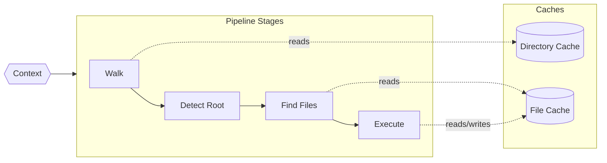
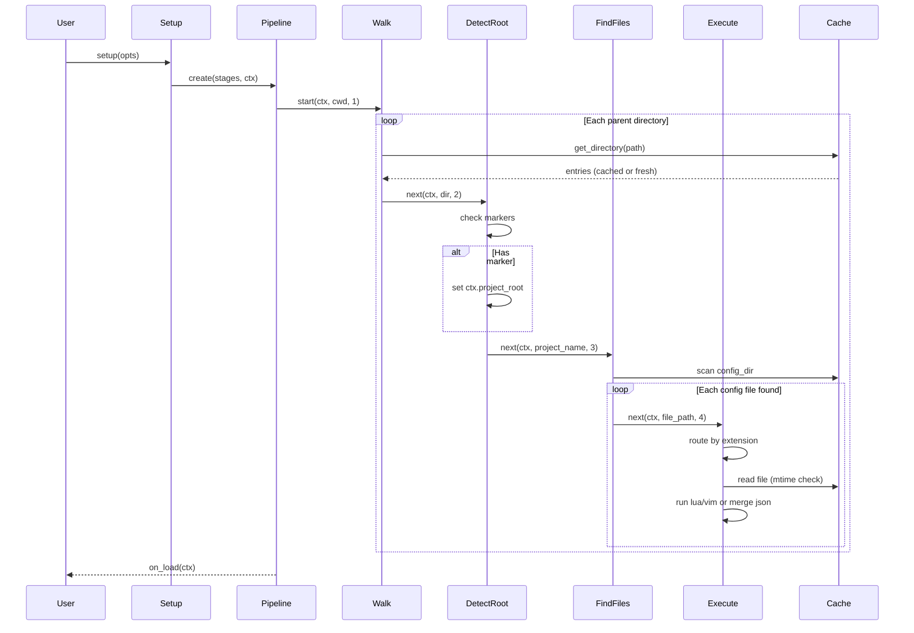
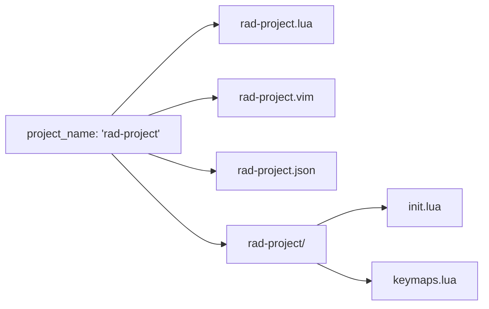
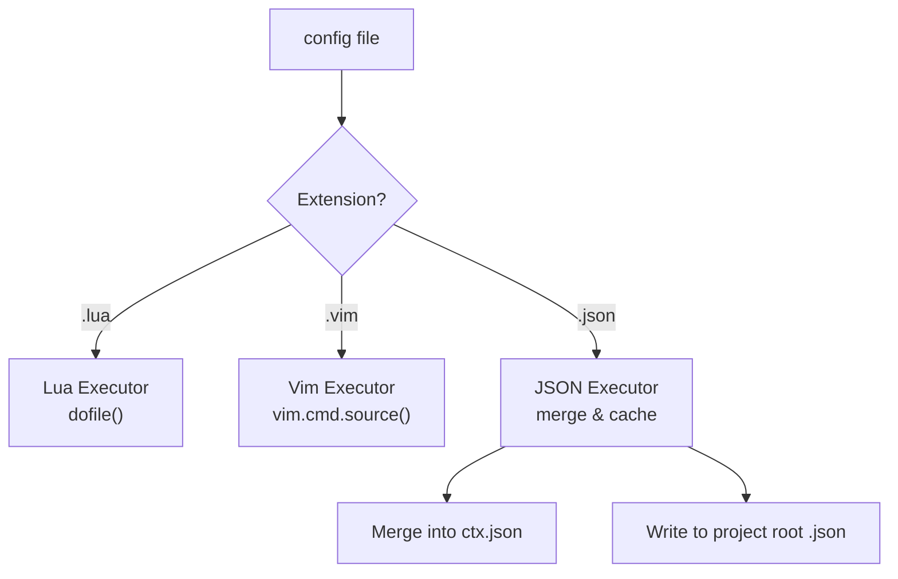
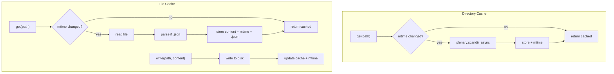

# nvim-project-config

Project-aware configuration loading for Neovim. Automatically detects your project root and loads Lua, Vimscript, or JSON configuration from a central location.

## Background

Working across many projects means context-switching between different toolchains, formatters, linters, and conventions. `nvim-project-config` bridges Neovim's global configuration with per-project needs by:

1. **Walking directories** upward from your current location to detect project roots (via `.git`, markers, etc.)
2. **Loading configuration** from `~/.config/nvim/projects/<project-name>/` in Lua, Vim, or JSON formats
3. **Executing or merging** those configurations, with late-loaded files winning on conflicts
4. **Caching intelligently** with mtime-based invalidation for responsive re-loading

The library is async-first via `plenary.async`, callback-driven, and designed for composability.

## Architecture Overview



Each stage receives the **context** (mutable configuration state), an **input item**, and its **stage number**. Stages call the next stage for each output produced—a streaming, pull-through design that naturally handles nested projects.

## Installation

```lua
-- lazy.nvim
{
  "rektide/nvim-project-config",
  dependencies = { "nvim-lua/plenary.nvim" },
  config = function()
    require("nvim-project-config").setup({})
  end
}
```

## Quick Start

```lua
require("nvim-project-config").setup({
  -- Uses defaults: walk up to find .git, load from stdpath("config")/projects/
})
```

For a project at `~/src/rad-project/`, this loads:
- `~/.config/nvim/projects/rad-project.lua`
- `~/.config/nvim/projects/rad-project.vim`
- `~/.config/nvim/projects/rad-project.json`
- `~/.config/nvim/projects/rad-project/*.lua` (and .vim, .json)

## Configuration

### Short Form

```lua
require("nvim-project-config").setup({
  config_dir = vim.fn.stdpath("config") .. "/projects",
  root_markers = { ".git", ".hg", "Makefile" },
  on_load = function(ctx) print("Loaded: " .. ctx.project_root) end,
})
```

### Full Default Configuration

```lua
require("nvim-project-config").setup({
  -- Startup behavior
  startup = {
    enabled = true,           -- Load on startup? Set false for manual control
    watch_directory = false,  -- Re-run on config directory changes
    watch_buffer = false,     -- Re-run on buffer/cwd changes
  },

  -- Where to find project configs
  config_dir = function(ctx)
    return vim.fn.stdpath("config") .. "/projects"
  end,

  -- Pipeline stages (each is a function(ctx, input, stage_num, next_stage))
  pipeline = {
    require("nvim-project-config.stages.walk"),
    require("nvim-project-config.stages.detect_root"),
    require("nvim-project-config.stages.find_files"),
    require("nvim-project-config.stages.execute"),
  },

  -- Walk stage: traverse directories upward
  walk = {
    direction = "up",           -- "up" from cwd toward root
    matcher = nil,              -- Optional filter; nil = yield all directories
  },

  -- Detect root stage: identify project boundaries
  detect_root = {
    markers = { ".git", ".hg", ".svn", "Makefile", "package.json" },
    override = false,           -- Override if root already set?
  },

  -- Find files stage: locate config files
  find_files = {
    -- Finder receives (ctx, project_name) and yields file paths
    finder = function(ctx, project_name)
      local base = ctx.config_dir
      return {
        base .. "/" .. project_name .. ".lua",
        base .. "/" .. project_name .. ".vim",
        base .. "/" .. project_name .. ".json",
        base .. "/" .. project_name .. "/",  -- Also scan subdirectory
      }
    end,
    extensions = { ".lua", ".vim", ".json" },
  },

  -- Execute stage: run/load config files
  execute = {
    -- Router maps extensions to executors
    router = {
      [".lua"] = require("nvim-project-config.executors.lua"),
      [".vim"] = require("nvim-project-config.executors.vim"),
      [".json"] = require("nvim-project-config.executors.json"),
    },
  },

  -- Caching
  cache = {
    directory = {
      enabled = true,
      mtime_check = true,       -- Check mtime before returning cached entries
    },
    file = {
      enabled = true,
      mtime_check = true,       -- Reload if file changed on disk
      write_through = true,     -- Writes to cache go to disk
    },
  },

  -- Callbacks
  on_load = nil,                -- function(ctx) called after successful load
  on_error = nil,               -- function(err, ctx) called on errors
  on_clear = nil,               -- function(ctx) called when context cleared
})
```

### Matchers

Matchers are used throughout for flexible pattern matching. A matcher can be:

| Type | Example | Behavior |
|------|---------|----------|
| String | `".git"` | Exact match |
| Pattern | `"%.lua$"` | Lua pattern match |
| Function | `function(name) return name:match("^%.") end` | Custom logic |
| Table | `{ ".git", ".hg", is_root }` | OR of all elements |

Utility wrappers for composition:

```lua
local M = require("nvim-project-config.matchers")

M.any(".git", ".hg", M.fn(custom_check))   -- OR
M.all(".git", M.not_(".gitignore"))        -- AND
M.not_(".DS_Store")                        -- Negate
```

### Nested Project Names

For monorepos with sub-packages, use nested names:

```
~/src/big-repo/packages/frontend/
```

Loads configuration from:
- `projects/big-repo.lua`
- `projects/big-repo/frontend.lua`

The deeper file wins on merge conflicts.

## File Structure

```
nvim-project-config/
├── lua/
│   └── nvim-project-config/
│       ├── init.lua              # Entry point, setup()
│       ├── context.lua           # Context creation & management
│       ├── pipeline.lua          # Pipeline orchestration
│       ├── cache/
│       │   ├── directory.lua     # Directory listing cache (wraps plenary.scandir)
│       │   └── file.lua          # File content cache with mtime tracking
│       ├── stages/
│       │   ├── walk.lua          # Directory traversal
│       │   ├── detect_root.lua   # Project root detection
│       │   ├── find_files.lua    # Config file discovery
│       │   └── execute.lua       # File execution router
│       ├── executors/
│       │   ├── lua.lua           # dofile() for .lua
│       │   ├── vim.lua           # vim.cmd.source() for .vim
│       │   └── json.lua          # JSON merge with write-back
│       ├── matchers.lua          # Matcher utilities (any, all, not_)
│       └── watchers.lua          # Directory/buffer change watchers
└── doc/
    └── nvim-project-config.txt   # Vim help documentation
```

## Architecture Deep Dive

### Pipeline Flow



### Walk Stage

Traverses from current directory upward:

```mermaid
flowchart TB
    CWD["/home/user/src/rad-project/test"] --> P1["/home/user/src/rad-project"]
    P1 --> P2["/home/user/src"]
    P2 --> P3["/home/user"]
    P3 --> P4["/home"]
    P4 --> P5["/"]
    
    style CWD fill:#4a5568
    style P1 fill:#2d3748
    style P2 fill:#2d3748
```



Each directory is yielded to the next stage. The optional matcher filters which directories to emit.

### Detect Root Stage

Pass-through that marks `ctx.project_root` when markers match:

```lua
-- Pseudocode
function detect_root(ctx, dir, stage_num, next_stage)
  if matches_any(dir, ctx.config.detect_root.markers) then
    if not ctx.project_root or ctx.config.detect_root.override then
      ctx.project_root = dir
      ctx.project_name = vim.fn.fnamemodify(dir, ":t")
    end
  end
  next_stage(ctx, ctx.project_name, stage_num + 1)
end
```

### Find Files Stage

Called with project name, yields config files:



### Execute Stage

Routes files to type-specific executors:



### Caching Strategy



**File cache entries:**
```lua
{
  path = "/path/to/file.json",
  content = '{"key": "value"}',      -- Raw file content
  mtime = 1706540800,                 -- Last modified time
  json = { key = "value" },           -- Parsed JSON (for .json files)
}
```

On read, if mtime differs from disk, the entry is replaced fresh (clearing `.json`).

### JSON Executor Merge Strategy

Multiple JSON files merge with **last file wins**:

```lua
-- projects/rad-project.json
{ "indent": 2, "formatter": "prettier" }

-- projects/rad-project/overrides.json  
{ "formatter": "biome" }

-- Result in ctx.json:
{ "indent": 2, "formatter": "biome" }
```

Writes go to the project-root JSON file (created if missing).

### Context Lifecycle

Context is mutable and persists across the pipeline:

```lua
{
  -- Set by user config
  config_dir = "/home/user/.config/nvim/projects",
  
  -- Set by detect_root stage
  project_root = "/home/user/src/rad-project",
  project_name = "rad-project",
  
  -- Built by json executor
  json = { ... },
  
  -- Internal
  _files_loaded = { ... },
}
```

**Clear** resets:
- `project_root`
- `project_name`  
- `json` (synthesized object)
- `_files_loaded`

Config values persist.

## API

### Core

```lua
local npc = require("nvim-project-config")

npc.setup(opts)                    -- Initialize with options
npc.load(callback)                 -- Manually trigger load
npc.clear()                        -- Clear context, prepare for reload
npc.get_context()                  -- Get current context
```

### JSON Access

```lua
local json = require("nvim-project-config.executors.json")

json.get("key")                    -- Read from merged JSON
json.get("nested.key")             -- Dot notation supported
json.set("key", value)             -- Write (triggers file write)
json.set("nested.key", value)      -- Creates intermediate tables
```

### Cache Control

```lua
local cache = require("nvim-project-config.cache")

cache.directory.invalidate(path)   -- Force re-scan
cache.file.invalidate(path)        -- Force re-read
cache.clear_all()                  -- Nuclear option
```

## Examples

### Formatter Per-Project

`~/.config/nvim/projects/rad-project.lua`:
```lua
vim.opt_local.shiftwidth = 4
vim.opt_local.expandtab = false

vim.g.rad_project_formatter = "biome"
```

### LSP Configuration

`~/.config/nvim/projects/work-api.lua`:
```lua
local lspconfig = require("lspconfig")

lspconfig.tsserver.setup({
  root_dir = vim.fn.getcwd(),
  settings = {
    typescript = {
      preferences = { importModuleSpecifier = "relative" }
    }
  }
})
```

### JSON for Data

`~/.config/nvim/projects/notes.json`:
```json
{
  "last_opened": "2024-01-15",
  "favorite_files": ["README.md", "TODO.md"],
  "word_count_goal": 1000
}
```

Access in Lua:
```lua
local json = require("nvim-project-config.executors.json")
local goal = json.get("word_count_goal")
json.set("last_opened", os.date("%Y-%m-%d"))
```

## License

MIT

---

## Discussion Points

Several architectural questions remain open for refinement:

### 1. Pipeline Completion Detection

How do we know when the pipeline is fully done? Options:
- **Counter-based**: Track outstanding stage calls, fire callback at zero
- **Sentinel value**: Final stage emits a "done" marker
- **Timeout**: Debounce and assume done after quiet period
- **Explicit end**: Walk stage signals when it reaches `/` or a boundary

### 2. Clear Semantics

What exactly happens on `clear()`?
- **Hardcoded reset**: Directly nil out specific context fields
- **Event-based**: Emit `on_clear`, let stages clean themselves up
- **Recreate**: Build fresh pipeline stages, new context object

### 3. Watcher Granularity

For `watch_buffer`, what triggers reload?
- `BufEnter` any buffer?
- Only when `cwd` actually changes?
- Debounced to avoid thrashing?

### 4. Error Boundaries

When a stage fails:
- Stop pipeline? Continue with remaining?
- Per-file error isolation in execute stage?
- Retry semantics for transient failures?

### 5. Nested Project Priority

With `repo/package` names:
- Load both `repo.lua` and `repo/package.lua`?
- Or just the most specific?
- Merge order guarantees?

### 6. mtime Fallback

You mentioned "test mtime works, fall back to dirty cache." Implementation:
- Check once at startup?
- Per-file capability detection?
- What's the fallback trigger—exception? Wrong mtime?

These decisions shape the library's personality. Happy to dive deeper into any area.
