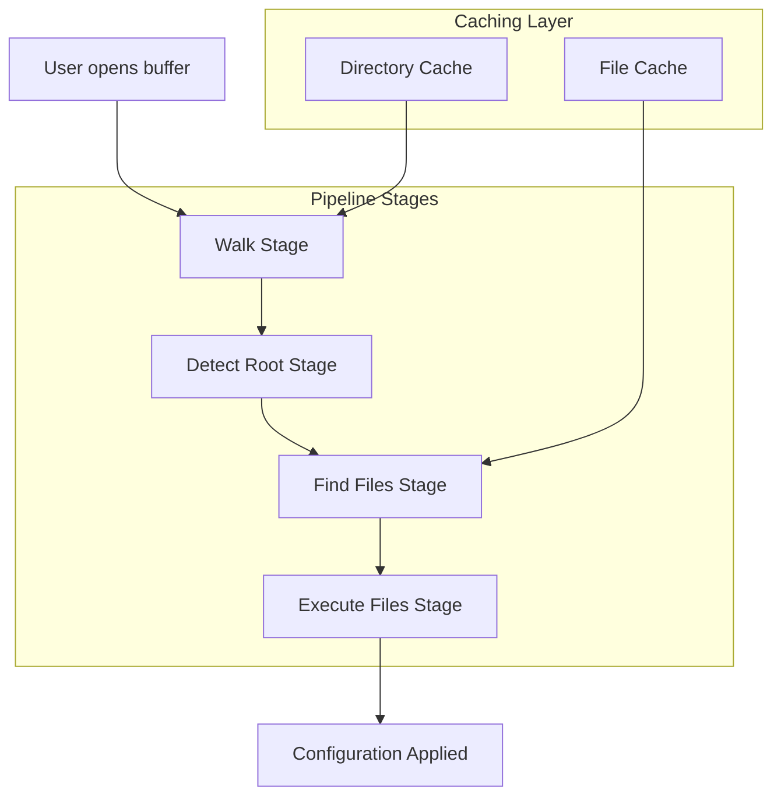
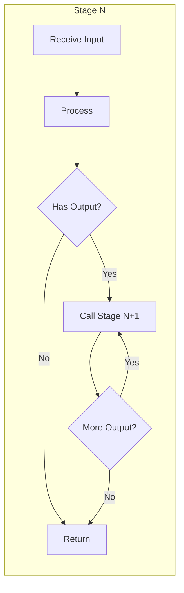
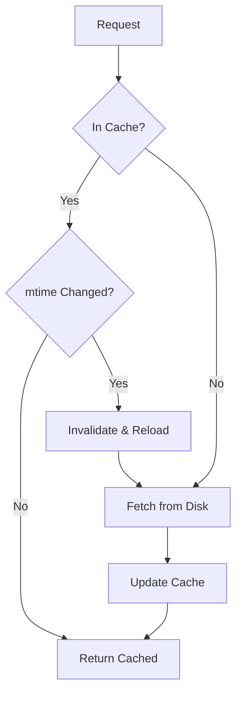
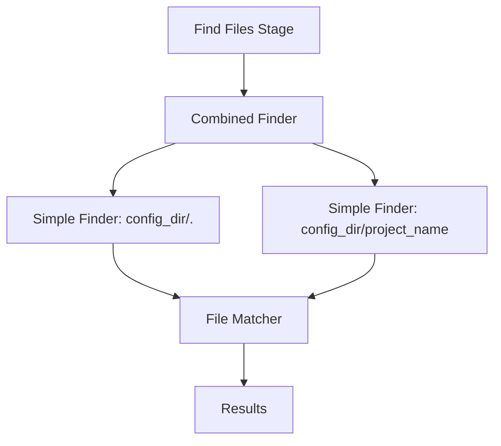
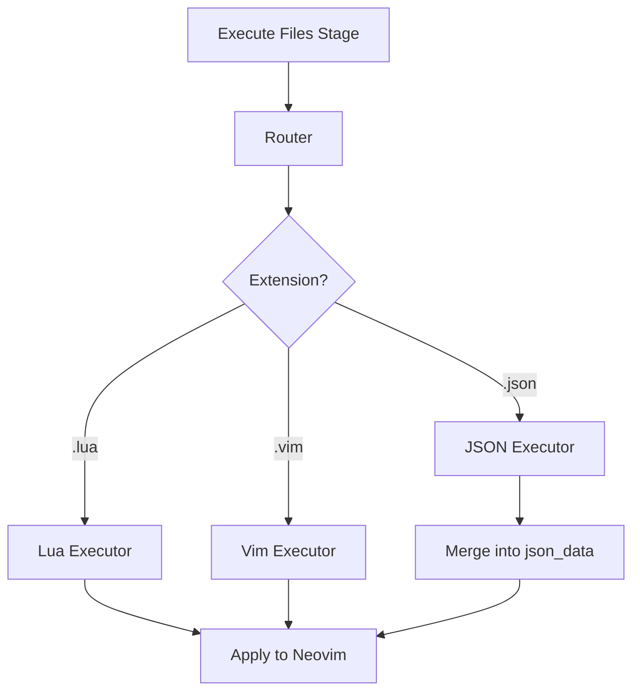
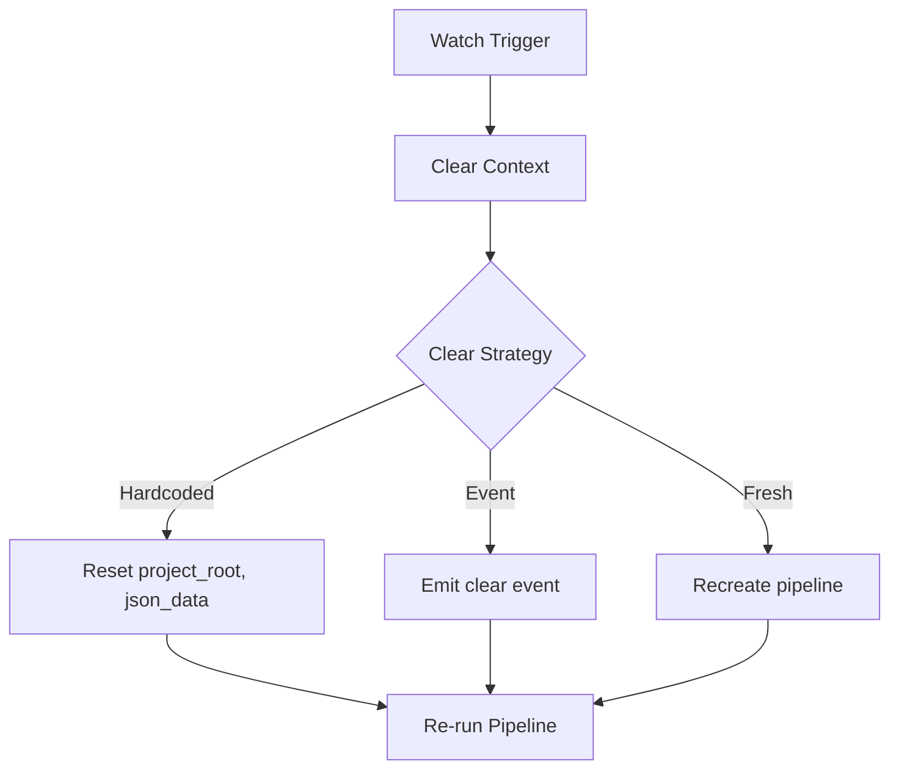

# nvim-project-config

> Per-project configuration for Neovim with smart detection, flexible loading, and seamless integration.

## Introduction

Every project is different. Your Neovim configuration should adapt to the project you're working on, not fight against it. `nvim-project-config` automatically detects which project you're in and loads the appropriate configuration—whether that's project-specific settings, keymaps, or tooling preferences.

This library provides a robust, asynchronous pipeline for project detection and configuration loading. It walks your directory tree, identifies project roots using configurable matchers, finds configuration files in your Neovim config directory, and executes them using pluggable handlers for Lua, Vim script, and JSON.

## Architecture Overview



The system operates through a **configurable pipeline** with four stages:

1. **Walk**: Traverses directories upward from current file, yielding each as a potential project
2. **Detect Root**: Identifies the project root using matchers (e.g., `.git` folder)
3. **Find Files**: Locates configuration files in `vim.fn.stdpath("config")/projects/`
4. **Execute Files**: Runs found configurations through appropriate handlers

Each stage is **pluggable**—you can replace or extend any stage. Stages communicate via a **mutable context object** that carries state through the pipeline.

## Configuration

Configuration is passed to the `setup()` function. All values can be static or functions evaluated at runtime.

### Default Configuration

```lua
local project_config = require('nvim-project-config')

project_config.setup({
  -- Configuration directory for project configs
  -- String or function returning string
  config_dir = function()
    return vim.fn.stdpath("config") .. "/projects"
  end,
  
  -- Pipeline stages (order matters)
  pipeline = {
    "walk",
    "detect_root", 
    "find_files",
    "execute_files"
  },
  
  -- Stage implementations
  stages = {
    walk = {
      -- Walk upward from current file directory
      direction = "up",
      -- Optional matcher to filter which directories yield
      -- By default yields all directories
      matcher = nil,
    },
    
    detect_root = {
      -- Matchers to identify project root
      -- Supports: string, table of strings, function, regex, or composed matchers
      matcher = ".git",
      -- Whether to override existing project root if already set
      override = false,
    },
    
    find_files = {
      -- File finder function
      -- Receives context and project name, returns list of files
      finder = "default",
      -- File name matcher
      -- Used to match project-specific files
      file_matcher = function(project_name)
        return {
          project_name .. ".lua",
          project_name .. ".vim", 
          project_name .. ".json"
        }
      end,
    },
    
    execute_files = {
      -- Router that delegates to file-type executors
      router = "default",
      -- File extension to executor mapping
      -- Can be single string, list, or matcher function
      by_extension = {
        lua = "lua",
        vim = "vim",
        json = "json"
      }
    }
  },
  
  -- Executor implementations
  executors = {
    lua = {
      -- Executes Lua files in a controlled environment
      -- Has access to context
    },
    vim = {
      -- Sources Vim script files
    },
    json = {
      -- Loads and merges JSON files
      -- Writes go to project root JSON file
      -- Caches with mtime checking
    }
  },
  
  -- Loading behavior
  loading = {
    -- "startup" | "lazy" | "manual"
    -- startup: load when plugin initializes
    -- lazy: load on first buffer enter
    -- manual: only load when explicitly called
    on = "startup",
    
    -- Watch for changes and auto-reload
    watch = {
      -- Watch config directory for changes
      directory = false,
      -- Watch current buffer's directory for changes
      buffer = false,
    }
  },
  
  -- Caching configuration
  cache = {
    -- Directory cache wraps plenary.ls_async
    directory = {
      enabled = true,
    },
    -- File cache stores contents and metadata
    file = {
      enabled = true,
      -- Check mtime before yielding cached results
      check_mtime = true,
    }
  }
})
```

### Flexible Matching

Matchers are a core concept supporting multiple forms:

```lua
-- String: exact match
matcher = ".git"

-- Table: any of these match (OR)
matcher = {".git", ".hg", "package.json"}

-- Function: custom logic
matcher = function(path)
  return vim.fn.isdirectory(path .. "/.git") == 1
end

-- Regex pattern
matcher = vim.regex("\\.git$")

-- Composed matchers
local matchers = require('nvim-project-config.matchers')
matcher = matchers.and_({".git", "package.json"})  -- Both must exist
matcher = matchers.not_(".hg")  -- Must NOT match
matcher = matchers.or_({".git", matchers.and_({"src", "package.json"})})
```

## File Structure

```
~/.config/nvim/
├── init.lua
├── lua/
│   └── nvim-project-config/
│       ├── init.lua              -- Main entry point, setup()
│       ├── pipeline.lua          -- Pipeline orchestration
│       ├── context.lua           -- Context object definition
│       ├── cache/
│       │   ├── directory.lua     -- Directory cache (ls_async wrapper)
│       │   └── file.lua          -- File cache with mtime tracking
│       ├── stages/
│       │   ├── walk.lua          -- Directory walking stage
│       │   ├── detect_root.lua   -- Project root detection
│       │   ├── find_files.lua    -- File discovery
│       │   └── execute_files.lua -- File execution
│       ├── executors/
│       │   ├── router.lua        -- Default file-type router
│       │   ├── lua.lua           -- Lua file executor
│       │   ├── vim.lua           -- Vim script executor
│       │   └── json.lua          -- JSON executor with merge/write
│       ├── matchers.lua          -- Matcher utilities (and, or, not)
│       └── watch.lua             -- File watching for auto-reload
└── projects/                     -- Your project configs
    ├── rad.lua                   -- Config for "rad" project
    ├── rad/
    │   └── extra.lua             -- Additional rad config
    ├── myrepo-package.lua        -- Nested: repo "myrepo", package "package"
    └── myrepo/
        └── package.lua           -- Same as above, different layout
```

## Detailed Architecture

### Pipeline Execution Model



Stages are **asynchronous** and **callback-based**. Each stage receives:
- `context`: Mutable configuration state
- `input`: Data from previous stage
- `stage_num`: Current position in pipeline

Stages call the next stage via a continuation pattern. When a stage produces output, it invokes the next stage with that output. This enables:
- **Streaming results**: Multiple files found → multiple executions
- **Early termination**: Stages can choose not to call next stage
- **Parallel potential**: Async operations without blocking

### Context Object

The context is **mutable** and evolves through the pipeline:

```lua
context = {
  -- Configuration (immutable reference to setup options)
  config = { ... },
  
  -- Discovered project information
  project_root = nil,        -- Set by detect_root stage
  project_name = nil,        -- Derived from project_root
  
  -- Caches (populated by cache layers)
  dir_cache = DirectoryCache,
  file_cache = FileCache,
  
  -- JSON synthesis (populated by json executor)
  json_data = {},
  
  -- Pipeline state
  current_stage = 1,
  stage_outputs = {},
}
```

### Caching Strategy

Two-level caching for performance:



**Directory Cache** (`cache/directory.lua`):
- Wraps `plenary.ls_async`
- Stores all directory listings
- Walk operations read-through this cache
- Invalidated when directory mtime changes

**File Cache** (`cache/file.lua`):
- Stores: filename, content, mtime
- Write-through: writes update cache and disk
- Extended data: `.json` field for parsed JSON
- On mtime change: clears extended data, reloads content

### File Discovery

The default finder uses a **composition pattern**:



The `file_matcher` is reused across both find operations. This allows:
- Global configs in `projects/init.lua` applied to all projects
- Project-specific configs in `projects/{name}.lua`
- Nested configs: `projects/myrepo/package.lua` for `myrepo/package`

### Execution Model



**Lua/Vim Executors**: Direct execution with access to context

**JSON Executor**: 
- Parses JSON files
- Merges multiple files (later files override earlier)
- Provides API for reading/writing
- Persists writes to project root JSON file
- Creates file if doesn't exist

### Project Name Nesting

Projects can have nested names to support monorepos:

```
Project name: "myrepo/package"

Config lookup order:
1. projects/myrepo-package.lua      (flattened)
2. projects/myrepo/package.lua      (nested)
3. projects/myrepo/package/init.lua (directory)
```

This enables repository-level settings and package-level overrides.

### Watching and Reloading



When watching is enabled:
- Directory watcher: monitors config directory, clears cache on change
- Buffer watcher: monitors current buffer's directory
- Clear operation resets mutable context state
- Pipeline re-runs automatically

### Composable Tools

The `matchers` module provides utilities for complex matching:

```lua
local m = require('nvim-project-config.matchers')

-- Process single item, string, list, or function uniformly
local processed = m.process(item)

-- Logical combinations
m.and_({matcher1, matcher2})   -- All must match
m.or_({matcher1, matcher2})    -- Any must match  
m.not_(matcher)                -- Negation

-- These compose arbitrarily
m.or_({
  ".git",
  m.and_({"package.json", m.not_(".hg")})
})
```

All configuration options accepting "matcher" use this processor, enabling consistent behavior across the API.

## Developer Experience

### Getting Started

```lua
-- Minimal setup - uses all defaults
require('nvim-project-config').setup()

-- Create your first project config
-- ~/.config/nvim/projects/my-project.lua
vim.opt_local.tabstop = 4
vim.opt_local.shiftwidth = 4
vim.keymap.set('n', '<leader>tb', ':!npm test<CR>', { buffer = true })
```

### Advanced Configuration

```lua
require('nvim-project-config').setup({
  -- Custom project detection
  stages = {
    detect_root = {
      matcher = function(path)
        -- Node projects use package.json
        -- But not in node_modules
        return vim.fn.filereadable(path .. "/package.json") == 1
           and vim.fn.isdirectory(path .. "/node_modules") == 0
      end
    }
  },
  
  -- Auto-reload when config changes
  loading = {
    on = "lazy",
    watch = {
      directory = true
    }
  },
  
  -- Custom executor for .toml files
  executors = {
    toml = {
      setup = function(ctx)
        -- Parse and apply TOML settings
      end
    }
  },
  stages = {
    execute_files = {
      by_extension = {
        toml = "toml"  -- Route .toml to custom executor
      }
    }
  }
})
```

### Programmatic API

```lua
local pc = require('nvim-project-config')

-- Manually trigger load
pc.load()

-- Access current project settings
local json = pc.get_json()  -- Returns merged JSON data
json.set('key', 'value')    -- Writes to project root JSON

-- Check cache status
print(pc.cache_status())

-- Clear and reload
pc.clear()
pc.load()
```

### Project Config Examples

**Lua Configuration** (`projects/web-app.lua`):
```lua
-- Access context if needed
local ctx = ...

-- Project-specific settings
vim.opt_local.tabstop = 2
vim.opt_local.shiftwidth = 2

-- Project-specific keymaps
vim.keymap.set('n', '<leader>rd', ':!npm run dev<CR>')

-- Load project-specific plugins conditionally
if vim.fn.executable('jest') == 1 then
  -- Setup test runner
end
```

**JSON Configuration** (`projects/web-app.json`):
```json
{
  "lsp": {
    "eslint": {
      "enabled": true
    }
  },
  "formatting": {
    "on_save": true,
    "formatter": "prettier"
  }
}
```

Access from Lua:
```lua
local pc = require('nvim-project-config')
local settings = pc.get_json()

if settings.lsp and settings.lsp.eslint then
  -- Configure ESLint
end
```

## Open Questions

- **Pipeline completion**: How do we detect when the entire pipeline is done? Each stage calls the next, but there's no explicit "done" callback.

- **Clear strategy**: What exactly gets cleared? Should this be:
  - Hardcoded list (project_root, json_data)
  - Event-based (emit 'clear' and let handlers decide)
  - Fresh pipeline recreation

- **Error handling**: How should stage failures propagate? Should one failed file stop execution of others?

- **Async boundaries**: Should stages be able to yield multiple times before calling next stage (generator pattern)?

## License

MIT
