# nvim-project-config

> Per-project Neovim configuration with a pluggable, async-first architecture.

## Introduction

Every project is different. Your Neovim configuration should adapt to where you're working.

`nvim-project-config` automatically discovers your current project and loads tailored configuration—from keybindings that make sense for your codebase, to project-specific linting rules, to custom commands that automate your workflow. It walks up your directory tree, finds your project root, and executes configuration files written in Lua, Vimscript, or JSON.

The library is built around a simple pipeline: **find** the project, **discover** configuration files, **execute** them. Each stage is pluggable and configurable, letting you adapt the behavior to your workflow without fighting the defaults.

## Architecture

```mermaid
flowchart TB
    subgraph Input["📁 Current Directory"]
        CWD["~/src/rad-project/test"]
    end
    
    subgraph Stage1["Stage 1: Project Discovery"]
        WALK["Directory Walker"]
        MATCH["Matcher Chain<br/>(default: .git)"]
        PROJ["Project Context<br/>name: 'rad'"]
    end
    
    subgraph Stage2["Stage 2: Configuration Discovery"]
        FINDER["Composite Finder"]
        F1["Finder A<br/>(project root)"]
        F2["Finder B<br/>(project-specific subdir)"]
        FILES["Configuration Files<br/>rad.lua, rad.vim, rad.json"]
    end
    
    subgraph Stage3["Stage 3: Execution"]
        EXEC["Composite Executor"]
        LUA["Lua/Vim Executor"]
        JSON["JSON Executor<br/>(with mtime caching)"]
    end
    
    CWD --> WALK
    WALK --> MATCH
    MATCH --> PROJ
    PROJ --> FINDER
    FINDER --> F1
    FINDER --> F2
    F1 --> FILES
    F2 --> FILES
    FILES --> EXEC
    EXEC --> LUA
    EXEC --> JSON
```



The architecture follows a **pipeline pattern** with three distinct stages:

1. **Project Discovery**: Walks the directory tree upward, applying matchers to identify the project root and extract a project name
2. **Configuration Discovery**: Uses composable finders to locate configuration files in the project-specific config directory
3. **Execution**: Runs discovered files through appropriate executors, with special handling for JSON (cached with modification-time checking)

Each stage operates on a **Context** object that carries the project name and config directory through the pipeline.

## Quick Start

```lua
-- Minimal setup - uses all defaults
require('nvim-project-config').setup()

-- Or with custom configuration
require('nvim-project-config').setup({
  -- Find projects by looking for .git or package.json
  matchers = { '.git', 'package.json' },
  -- Load config from ~/.config/nvim/projects/
  config_dir = vim.fn.stdpath('config') .. '/projects',
})
```

## Configuration

### Short Reference

```lua
require('nvim-project-config').setup({
  -- How to find the project root and name
  project_finder = find_project_default,  -- function or preset name
  
  -- Where to load configuration from
  config_dir = function() return vim.fn.stdpath('config') .. '/projects' end,
  
  -- How to find configuration files
  config_finder = find_config_composite,  -- function or preset name
  
  -- How to execute configuration files
  executor = execute_composite,           -- function or preset name
})
```

### Full Configuration

```lua
require('nvim-project-config').setup({
  -- PROJECT DISCOVERY
  -- =================
  
  -- Strategy for walking directories to find project root
  -- Can be: function, string (preset name), or table
  project_finder = {
    -- Preset: 'walk_up' (default), 'cwd', or custom function
    strategy = 'walk_up',
    
    -- Matchers determine when we've found a project root
    -- Can be: string, function, or list of strings/functions
    -- String matchers check for file/directory existence
    -- Function matchers receive (dir, context) return truthy if match
    matchers = { '.git' },
    
    -- How to extract project name from matched directory
    -- Can be: function or preset string
    -- Default uses directory name
    extract_name = 'dirname',
    
    -- Fallback project name if no match found
    fallback_name = nil,  -- nil means use cwd name
  },
  
  -- CONFIGURATION DIRECTORY
  -- =======================
  
  -- Where project configurations live
  -- Can be: string path or function returning path
  config_dir = function()
    return vim.fn.stdpath('config') .. '/projects'
  end,
  
  -- CONFIGURATION DISCOVERY
  -- =======================
  
  -- Strategy for finding configuration files
  config_finder = {
    -- Preset: 'composite' (default) runs multiple finders
    strategy = 'composite',
    
    -- Finders to run (each returns list of file paths)
    finders = {
      {
        -- Look in config_dir directly (the '.' finder)
        strategy = 'simple',
        subdir = '.',
        -- Match files by pattern
        matcher = function(filename, context)
          local extensions = { '.lua', '.vim', '.json' }
          for _, ext in ipairs(extensions) do
            if filename == context.project_name .. ext then
              return true
            end
          end
          return false
        end,
      },
      {
        -- Look in project-named subdirectory
        strategy = 'simple',
        subdir = function(ctx) return ctx.project_name end,
        -- Same matcher as above (reused by default)
        matcher = 'inherit',  -- or specify new matcher
      },
    },
  },
  
  -- EXECUTION
  -- =========
  
  -- Strategy for executing configuration files
  executor = {
    strategy = 'composite',
    
    -- Mapping of file extensions to executors
    -- Can be: string (preset), function, or list of either
    -- Keys are extensions (without dot), 'default' catches rest
    by_extension = {
      lua = 'lua',
      vim = 'vim',
      json = 'json',
      default = { 'lua', 'vim' },  -- try both
    },
    
    -- Executor-specific configuration
    executors = {
      -- Lua/Vim executor: sources the file
      lua = {
        -- Called before sourcing
        preprocess = nil,
        -- Environment available to the file via _G
        env = {},
      },
      
      -- JSON executor: loads into memory with mtime caching
      json = {
        -- Cache configuration
        cache = {
          enabled = true,
          -- Check mtime before every read/write
          check_mtime = true,
          -- If mtime check fails (e.g., fs issues), assume dirty
          fallback_dirty = true,
        },
        -- Access pattern: project_config.json.get('key.path')
        -- Writing: project_config.json.set('key.path', value)
        accessor = 'project_config.json',
      },
    },
  },
  
  -- CONTEXT
  -- =======
  
  -- Additional data added to the context object
  -- Available to all functions throughout the pipeline
  context = {
    -- Your custom data here
    -- e.g., workspace_root, environment, etc.
  },
})
```

### Matcher Flexibility

Matchers are used throughout the system and support a flexible type system:

```lua
-- Single string: exact match
matcher = '.git'

-- Single function: custom logic
matcher = function(path, context)
  return vim.fn.isdirectory(path .. '/.git') == 1
end

-- List: any can match (OR logic)
matchers = { '.git', 'package.json', '.project-root' }

-- List with mixed types
matchers = {
  '.git',
  function(path, ctx) return vim.uv.fs_stat(path .. '/Cargo.toml') end,
  { '.hg', '.svn' },  -- nested OR
}

-- Negation with 'not:' prefix (for exclusion)
matchers = { '.git', 'not:node_modules' }
```

## File Structure

```
nvim-project-config/
├── README.md
├── lua/
│   └── nvim-project-config/
│       ├── init.lua              # Main entry point, setup()
│       ├── context.lua           # Context object definition
│       ├── config.lua            # Configuration management & defaults
│       ├── 
│       ├── finder/               # Project discovery stage
│       │   ├── init.lua          # Finder exports and composition
│       │   ├── walk_up.lua       # Directory walking strategy
│       │   ├── cwd.lua           # Current directory strategy
│       │   └── matchers.lua      # Matcher utilities (string/function/list)
│       │
│       ├── loader/               # Configuration discovery stage
│       │   ├── init.lua          # Loader exports
│       │   ├── composite.lua     # Runs multiple finders
│       │   ├── simple.lua        # Single directory finder
│       │   └── 
│       │
│       └── executor/             # Execution stage
│           ├── init.lua          # Executor exports
│           ├── composite.lua     # Routes by extension
│           ├── lua.lua           # Lua/vimscript executor
│           └── json.lua          # JSON executor with caching
│
└── tests/
    └── nvim-project-config/
        └── 
```

## Detailed Architecture

### Stage 1: Project Discovery


**Key Components:**

- **Directory Walker**: Implemented using `plenary.async` for non-blocking directory traversal. Walks upward from the current working directory.

- **Matchers**: A flexible matching system that accepts:
  - **String matchers**: Check for file/directory existence by name
  - **Function matchers**: Custom logic receiving `(directory_path, context)`
  - **Lists**: OR-combined matchers (any match succeeds)
  - **Negation**: `not:` prefix for exclusions

- **Name Extraction**: Configurable strategy for deriving the project name from the matched directory. Default uses the directory basename.

**Context Object** (passed through all stages):
```lua
{
  project_name = "rad",
  project_root = "/home/user/src/rad-project",
  config_dir = "/home/user/.config/nvim/projects",
  cwd = "/home/user/src/rad-project/test",
  -- plus any user-defined context
}
```

### Stage 2: Configuration Discovery


**The Composite Pattern:**

The default configuration finder is **composite**, meaning it runs multiple child finders and merges their results. This enables the common pattern of:
1. Looking for `{project_name}.{lua,vim,json}` in the config root
2. Looking for any matching files in `{config_dir}/{project_name}/`

**Simple Finder:**

Each simple finder:
1. Resolves its `subdir` (relative to `config_dir`)
2. Scans that directory
3. Applies the `matcher` to filter files
4. Returns absolute file paths

The `subdir` and `matcher` are both configurable with the same flexible type system (string, function, or list).

### Stage 3: Execution


**Lua/Vim Executor:**

Sources the file in an isolated environment. The context object is available to the configuration file, enabling dynamic behavior based on project metadata.

**JSON Executor:**

Special handling for JSON files to enable programmatic access:

1. **Loading**: Parses JSON into a Lua table on first access
2. **Caching**: Stores the parsed data and file modification time
3. **mtime Checking**: Before any read or write operation, checks if the file has been modified externally
4. **Fallback Strategy**: If mtime checking fails (filesystem issues), the cache is treated as dirty on every access to prevent stale data
5. **API**: Exposes `get(path)` and `set(path, value)` methods with dot-notation path support (`get('editor.tabSize')`)

**Extension Routing:**

The composite executor routes files based on their extension:

```lua
by_extension = {
  lua = 'lua',           -- single executor
  vim = 'vim',           -- single executor  
  json = 'json',         -- single executor
  default = { 'lua', 'vim' },  -- try multiple
}
```

Each value can be:
- **String**: Name of a registered executor
- **Function**: Custom executor function
- **List**: Multiple executors to run in sequence

## Usage Examples

### Project-Specific Configuration

Create `~/.config/nvim/projects/rad.lua`:

```lua
-- Executed when working in the 'rad' project
vim.bo.tabstop = 2
vim.bo.shiftwidth = 2

-- Project-specific keymaps
vim.keymap.set('n', '<leader>rt', ':!npm test<CR>', { buffer = true })
```

Or create a directory for complex projects:

```
~/.config/nvim/projects/rad/
├── init.lua      -- main config
├── keymaps.lua   -- loaded by init.lua
└── settings.json -- JSON configuration
```

### Accessing JSON Configuration

```lua
-- In your init.lua or after project config loads
local json = require('nvim-project-config').json

-- Read nested values
local tabSize = json.get('editor.tabSize')  -- returns value or nil

-- Write values (persists to file)
json.set('editor.tabSize', 4)
```

### Custom Matchers

Find projects by custom logic:

```lua
require('nvim-project-config').setup({
  project_finder = {
    matchers = {
      '.git',
      function(dir, ctx)
        -- Custom: check for specific marker file with content
        local marker = dir .. '/.project-type'
        local f = io.open(marker, 'r')
        if f then
          local content = f:read('*l')
          f:close()
          return content == 'rad'
        end
        return false
      end
    }
  }
})
```

### Conditional Execution

```lua
-- Only load for specific project types
if vim.g.project_type == 'node' then
  require('nvim-project-config').setup({
    config_finder = {
      finders = {
        {
          subdir = function(ctx) 
            return ctx.project_type == 'node' and 'node-projects' or nil
          end
        }
      }
    }
  })
end
```

## API Reference

### Core Functions

```lua
-- Initialize and load configuration for current project
require('nvim-project-config').setup(opts)

-- Manually trigger reload (useful after git checkout, etc.)
require('nvim-project-config').reload()

-- Get current context
local ctx = require('nvim-project-config').get_context()
-- Returns: { project_name, project_root, config_dir, ... }

-- Access JSON API (only available after setup)
local json = require('nvim-project-config').json
json.get(path)     -- Read value at path
json.set(path, value)  -- Write value at path
json.flush()       -- Force write to disk
```

### Extending

Register custom executors:

```lua
local executor = require('nvim-project-config.executor')

executor.register('toml', function(filepath, context)
  -- Parse and execute TOML configuration
  local content = vim.fn.readfile(filepath)
  local parsed = parse_toml(table.concat(content, '\n'))
  apply_configuration(parsed)
end)
```

## Contributing

Contributions welcome! Please ensure:
- Asynchronous operations use `plenary.async`
- New matchers follow the string/function/list pattern
- Tests cover both success and failure paths
- Documentation stays synchronized with code

## License

MIT
