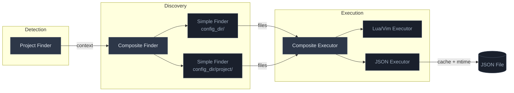

# nvim-project-config

[](https://opensource.org/licenses/MIT)

> Load Neovim configuration based on your current project directory

## Table of Contents

- [Background](#background)
- [Install](#install)
- [Usage](#usage)
  - [Basic Setup](#basic-setup)
  - [Configuration File Types](#configuration-file-types)
  - [JSON Settings with Programmatic Access](#json-settings-with-programmatic-access)
  - [Advanced Configuration](#advanced-configuration)
- [API](#api)
- [Architecture](#architecture)
- [Contributing](#contributing)
- [License](#license)

## Background

Different projects have different needs. A web frontend might want 2-space indentation, TypeScript LSP, and Prettier formatting. A systems project might want 4-space tabs, clangd, and different keybindings. Managing these differences in a single Neovim configuration becomes unwieldy.

`nvim-project-config` solves this by automatically detecting your current project and loading project-specific configuration. When you open a file in `~/src/rad-project/test/`, it will:

1. **Detect the project name** (`rad-project`) by walking up the directory tree, looking for markers like `.git`, `package.json`, or `Cargo.toml`
2. **Find configuration files** in your config directory (`~/.config/nvim/projects/rad-project.lua`)
3. **Execute the configuration** using the appropriate loader for each file type

The entire pipeline—project detection, file discovery, and execution—is pluggable. Each stage accepts either explicit values or functions, letting you customize behavior without replacing the whole system.

## Install

Using [lazy.nvim](https://github.com/folke/lazy.nvim):

```lua
{
  "rektide/nvim-project-config",
  config = function()
    require("nvim-project-config").setup()
  end
}
```

Using [packer.nvim](https://github.com/wbthomason/packer.nvim):

```lua
use {
  "rektide/nvim-project-config",
  config = function()
    require("nvim-project-config").setup()
  end
}
```

## Usage

### Basic Setup

```lua
require("nvim-project-config").setup()
```

With defaults, this looks for configs in `~/.config/nvim/projects/` matching your project name with `.lua`, `.vim`, or `.json` extensions.

### Configuration File Types

Place project configs in your config directory:

```
~/.config/nvim/projects/
├── rad-project.lua      # Executed as Lua
├── rad-project.vim      # Executed as Vimscript
├── rad-project.json     # Loaded as persistent settings
└── rad-project/         # Subdirectory configs also loaded
    └── keymaps.lua
```

#### Lua Configuration

```lua
-- ~/.config/nvim/projects/rad-project.lua
vim.opt_local.tabstop = 4
vim.opt_local.shiftwidth = 4
vim.keymap.set("n", "<leader>t", ":!npm test<CR>", { buffer = true })
```

#### Vimscript Configuration

```vim
" ~/.config/nvim/projects/rad-project.vim
setlocal shiftwidth=2
command! -buffer RunTests :!npm test
```

#### JSON Configuration

```json
{
  "lsp": { "servers": ["tsserver", "eslint"] },
  "lastOpenedFile": "/src/index.ts"
}
```

### JSON Settings with Programmatic Access

JSON files provide persistent key-value storage you can read and write at runtime:

```lua
local npc = require("nvim-project-config")

-- Read the full config
local settings = npc.get_json_config("rad-project")

-- Read a nested value
local servers = settings.lsp.servers

-- Write a value (persists to disk)
npc.set_json_config("rad-project", "lastOpenedFile", vim.fn.expand("%"))

-- Modify existing values with a function
npc.set_json_config("rad-project", "lsp.servers", function(servers)
  table.insert(servers, "tailwindcss")
  return servers
end)
```

The JSON executor caches files in memory and checks modification time before each access. If the file changed on disk, it reloads automatically. If mtime tracking fails on your filesystem, it falls back to reloading on every access.

### Advanced Configuration

#### Custom Config Directory

```lua
require("nvim-project-config").setup({
  -- String path
  config_dir = "~/.config/my-nvim-projects",

  -- Or function receiving context
  config_dir = function(ctx)
    return vim.fn.stdpath("config") .. "/projects"
  end
})
```

#### Custom Project Detection

```lua
require("nvim-project-config").setup({
  project_name_finder = function()
    local cwd = vim.fn.getcwd()
    local path = cwd

    while path ~= "/" do
      for _, marker in ipairs({ ".git", "package.json", "Cargo.toml" }) do
        if vim.fn.filereadable(path .. "/" .. marker) == 1 then
          return vim.fn.fnamemodify(path, ":t")
        end
      end
      path = vim.fn.fnamemodify(path, ":h")
    end

    return vim.fn.fnamemodify(cwd, ":t")  -- Fallback
  end
})
```

#### Custom Finder

The finder locates config files. The default is a composite that searches both the config directory root and a project-name subdirectory:

```lua
require("nvim-project-config").setup({
  finder = function(ctx)
    local simple = require("nvim-project-config.finders").simple
    return {
      simple(ctx, "."),              -- config_dir/*.{lua,vim,json}
      simple(ctx, ctx.project_name), -- config_dir/project-name/*
    }
  end
})
```

#### Custom File Matching

All matchers accept flexible input: a single string, a list, a function, or a mixed list:

```lua
require("nvim-project-config").setup({
  -- Single pattern
  file_matcher = "%.lua$",

  -- List of patterns
  file_matcher = { "%.lua$", "%.vim$" },

  -- Function
  file_matcher = function(project_name, filename)
    return filename:match("^" .. project_name .. "%.")
  end,

  -- Mixed
  file_matcher = { "%.json$", function(p, f) return f == "init.lua" end }
})
```

#### Custom Executors

Route files to different executors by extension or matcher:

```lua
require("nvim-project-config").setup({
  executor_map = {
    ["lua"] = require("nvim-project-config.executors").lua_vim,
    ["vim"] = require("nvim-project-config.executors").lua_vim,
    ["json"] = require("nvim-project-config.executors").json,

    -- Or use matchers for complex routing
    {
      match = function(filename) return filename:match("_test%.lua$") end,
      executor = my_custom_test_executor,
    },
  }
})
```

## API

### `setup(opts)`

Initialize with configuration options.

| Option | Type | Description |
|--------|------|-------------|
| `config_dir` | `string\|function` | Config directory path or `function(ctx) -> string` |
| `project_name_finder` | `function` | `function() -> string` returning project name |
| `finder` | `function` | `function(ctx) -> files[]` returning files to load |
| `file_matcher` | `string\|function\|table` | Pattern(s) or matcher function for file selection |
| `executor_map` | `table` | Map of extensions to executor(s) |

### `load()`

Manually trigger configuration loading for current directory.

### `get_context()`

Returns the current context object:

```lua
{
  project_name = "rad-project",
  config_dir = "/home/user/.config/nvim/projects",
}
```

### `get_json_config(project_name)`

Returns the parsed JSON configuration table, or `nil` if not found.

### `set_json_config(project_name, key_path, value)`

Sets a value in the JSON config. `key_path` uses dot notation for nesting. `value` can be a literal or a `function(current) -> new` transformer.

## Architecture

```
┌─────────────────┐     ┌─────────────┐     ┌──────────────┐
│ Project Finder  │ ──▶ │   Finder    │ ──▶ │   Executor   │
│ (detect name)   │     │ (find files)│     │ (run config) │
└─────────────────┘     └─────────────┘     └──────────────┘
        │                      │                    │
        ▼                      ▼                    ▼
   configurable           composite            composite
   walk strategy      simple + simple      lua/vim + json
```

Each stage passes a **context object** containing `project_name` and `config_dir`. This context flows through the pipeline, available to all configurable functions.



## Contributing

Contributions welcome. Please open an issue first to discuss significant changes.

## License

MIT © [rektide de la faye](https://github.com/rektide)
