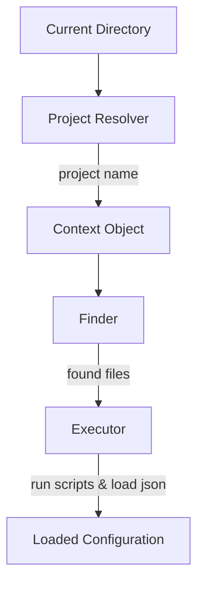
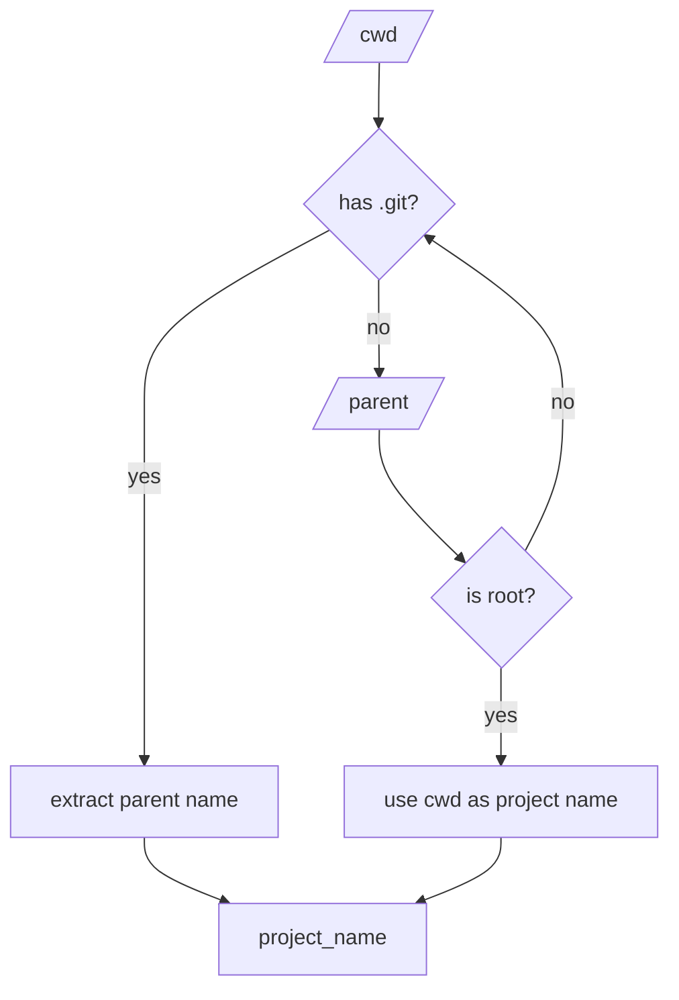
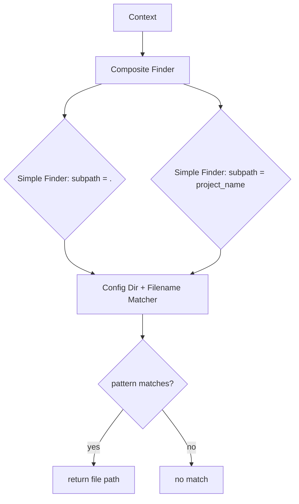

# nvim-project-config

A Neovim library for loading project-specific configuration.

## Introduction

Neovim configuration is typically global, but many workflows benefit from project-specific settings. nvim-project-config dynamically detects your current project and loads corresponding configuration files, making it easy to maintain different settings, keybindings, or workflows per project.

## What This Solves

When working across multiple projects, you often need:
- Project-specific LSP settings
- Different keybindings for different workflows
- Per-project debugging configurations
- Project-specific command aliases
- Workspace-specific UI tweaks

nvim-project-config automates this by:
1. Detecting your current project from the working directory
2. Locating and loading matching configuration files
3. Providing extensible loaders for Lua, Vim, and JSON configurations
4. Caching JSON settings with automatic reload on file changes

## Architecture Overview

nvim-project-config uses a three-stage pipeline:



The system is built around:
- **Project Resolver**: Discovers project name using directory walking strategies
- **Finder**: Locates configuration files using pattern matching
- **Executor**: Runs Lua/Vim scripts and loads JSON configurations
- **Matchers**: Flexible pattern matching for file selection and routing

## Installation

```lua
-- Using packer.nvim
use 'yourusername/nvim-project-config'
```

## Quick Start

```lua
local project_config = require('nvim-project-config')

-- Default setup
project_config.setup()

-- Manual load (if auto-load disabled)
project_config.load()
```

## Configuration

nvim-project-config is highly configurable. The entire system is designed around the concept of pluggable components:

### Basic Configuration

```lua
project_config.setup({
  -- Auto-load when Neovim starts or directory changes
  auto_load = true,

  -- Project resolver configuration
  project_resolver = {
    -- Configurable directory walking strategy
    walk_strategy = function(cwd)
      -- Default implementation walks up until .git is found
      -- Returns project name or falls back to cwd
    end,
  },

  -- Configuration directory: string or function
  -- Function receives context object
  config_dir = function(ctx)
    return vim.fn.stdpath('config') .. '/projects'
  end,
})
```

### Default Configuration (Full)

```lua
project_config.setup({
  auto_load = true,

  -- Project Resolver
  project_resolver = {
    -- Walks up directories looking for .git
    walk_strategy = walk_up_strategy({
      markers = { '.git' },
      fallback_to_cwd = true,
    }),
  },

  -- Config directory
  config_dir = function(ctx)
    return vim.fn.stdpath('config') .. '/projects'
  end,

  -- Finder: locates configuration files
  finder = composite_finder({
    -- Search in base config dir and project-name subdir
    finders = {
      simple_finder({ subpath = '.' }),
      simple_finder({ subpath = '${project_name}' }),
    },
    -- Filename patterns to match
    filename_matcher = or_matcher({
      '${project_name}.lua',
      '${project_name}.vim',
      '${project_name}.json',
    }),
  }),

  -- Executor: runs or loads found files
  executor = composite_executor({
    executors = {
      lua_executor(),
      vim_executor(),
      json_executor({
        cache_enabled = true,
      }),
    },
    -- Route files to executors by extension
    router = {
      '.lua' = lua_executor(),
      '.vim' = vim_executor(),
      '.json' = json_executor(),
    },
  }),
})
```

### Matcher System

Throughout nvim-project-config, matchers provide flexible pattern matching. A matcher can be:
- A **string**: simple exact match (e.g., `".lua"`)
- A **matcher function**: receives value, returns boolean
- A **list**: multiple matchers combined with OR logic

```lua
-- String matcher
router = {
  '.lua' = lua_executor(),
}

-- Function matcher
router = {
  function(ext)
    return ext == '.lua' or ext == '.vim'
  end = script_executor(),
}

-- List matcher (OR logic)
router = {
  { '.lua', '.vim' } = script_executor(),
  '.json' = json_executor(),
}

-- Use built-in matcher helpers
or_matcher({ '.lua', '.vim' })
and_matcher({
  function(s) return s:match('%.lua$') end,
  function(s) return not s:match('%.spec%.lua$') end,
})
```

## File Structure

Your Neovim config directory with nvim-project-config:

```
~/.config/nvim/
├── init.lua
├── projects/                 # nvim-project-config directory
│   ├── .init.lua             # Common project config (optional)
│   ├── my-project/
│   │   └── my-project.lua    # Project-specific Lua config
│   ├── my-proj/
│   │   └── my-proj.json      # Project-specific JSON settings
│   └── global.lua            # Default/fallback config
└── ...
```

How config discovery works:
1. If in `~/src/my-project/server`, project name is `my-project`
2. Searches `~/.config/nvim/projects/my-project/my-project.lua`
3. Also searches `~/.config/nvim/projects/my-project.lua`
4. Loads all found files using appropriate executors

## Architecture in Detail

### Context Object

The context object is passed throughout the pipeline, containing shared state:

```lua
{
  cwd = '/home/user/src/my-project/app',
  project_name = 'my-project',
  config_dir = '/home/user/.config/nvim/projects',
}
```

### Project Resolver



The project resolver walks up the directory tree using a configurable strategy. The default strategy:
- Starts at current working directory
- Checks each directory for marker files/folders (default: `.git`)
- When a marker is found, extracts the project name from directory name
- Falls back to using CWD if no marker found

### Finder



The finder locates configuration files using:
- **Composite Finder**: Combines multiple simple finders
- **Simple Finder**: Searches in a specified subpath
- **Filename Matcher**: Patterns to match against filenames

Default finder searches two locations:
1. `<config_dir>/<project_name>.{ext}`
2. `<config_dir>/<project_name>/<project_name>.{ext>`

### Executor

```mermaid
graph TD
    A[Found Files] --> B[Router]
    B -->|extension match| C{Executor Type}
    C -->|.lua|.vim| D[Script Executor]
    C -->|.json| E[JSON Executor]
    D --> F[dofile/vim.cmd]
    E --> G[loadjson]
    E --> H[Cache Manager]
    H --> I{file modified?}
    I -->|yes| J[reload JSON]
    I -->|no| K[use cached]
```

The executor runs or loads configuration files:
- **Composite Executor**: Manages multiple executors
- **Script Executor**: Runs Lua or Vim scripts directly
- **JSON Executor**: Loads JSON with caching

Router mapping:
- Single string: exact match (`.lua` → lua_executor)
- Matcher function: conditional routing
- List: OR logic for multiple extensions

### JSON Caching

JSON configuration is cached in memory for performance:
- Checks file modification time before each read/write
- Reloads if file was modified externally
- Graceful degradation: if mtime check fails, assumes dirty cache
- Write operations update cache atomically

## Creating Project Configuration

### Lua Configuration

`~/.config/nvim/projects/my-project/my-project.lua`:

```lua
-- Available in the global scope
-- vim.api, vim.fn, etc.

-- Set project-specific LSP settings
vim.lsp.set_config_keymaps({
  buffer = 0,
  format_on_save = false,
})

-- Add project-specific keybindings
vim.keymap.set('n', '<leader>tr', ':TermExec cmd="rails test"<CR>')
```

### Vim Script Configuration

`~/.config/nvim/projects/my-project/my-project.vim`:

```vim
" Project-specific Vimscript
setlocal shiftwidth=2
setlocal tabstop=2

let g:project_test_cmd = 'pytest'
```

### JSON Configuration

`~/.config/nvim/projects/my-project/my-project.json`:

```json
{
  "lsp": {
    "format_on_save": false,
    "max_line_length": 120
  },
  "test": {
    "command": "pytest",
    "args": ["-v", "--tb=short"]
  }
}
```

Accessing JSON programmatically:

```lua
local project_config = require('nvim-project-config')

-- Read JSON config
local lsp_settings = project_config.get_json('lsp')
print(lsp_settings.format_on_save)  -- false

-- Write JSON config
project_config.set_json('test.command', 'pytest --fast')

-- Full access
local full_config = project_config.get_json()
```

## Advanced Usage

### Custom Walk Strategy

```lua
project_config.setup({
  project_resolver = {
    walk_strategy = function(cwd)
      -- Custom logic: look for project.toml instead of .git
      local found = vim.fn.findfile('project.toml', cwd .. ';')
      if found ~= '' then
        local project_dir = vim.fn.fnamemodify(found, ':h')
        return vim.fn.fnamemodify(project_dir, ':t')
      end
      return vim.fn.fnamemodify(cwd, ':t')
    end,
  },
})
```

### Custom Finder

```lua
local custom_finder = {
  find = function(ctx)
    local paths = {
      ctx.config_dir .. '/' .. ctx.project_name .. '/config/init.lua',
      ctx.config_dir .. '/' .. ctx.project_name .. '/*.lua',
    }
    return vim.tbl_flatten(vim.tbl_map(vim.fn.glob, paths))
  end,
}

project_config.setup({
  finder = custom_finder,
})
```

### Custom Executor

```lua
local yaml_executor = {
  execute = function(filepath, ctx)
    local yaml = require('yaml')
    local content = vim.fn.readfile(filepath)
    local data = yaml.eval(table.concat(content, '\n'))
    -- Apply YAML configuration
  end,
}

project_config.setup({
  executor = composite_executor({
    executors = { lua_executor(), yaml_executor },
    router = {
      '.lua' = lua_executor(),
      '.yaml' = yaml_executor,
      '.yml' = yaml_executor,
    },
  }),
})
```

## API Reference

### `setup(config?)`

Initialize nvim-project-config with configuration.

### `load()`

Manually trigger project configuration loading.

### `get_json(path?)`

Read JSON configuration. Returns the full config if no path provided, or the value at the given dot-notation path.

### `set_json(path, value)`

Write a value to JSON configuration at the given dot-notation path. Saves immediately.

### `reload_json()`

Force reload JSON configuration from disk.

## Troubleshooting

### Configuration not loading

1. Check that `auto_load` is enabled
2. Verify the project name detection: `vim.b.nvim_project_config_name`
3. Check that configuration files exist in expected locations

### JSON cache issues

If file modification time detection isn't working on your system:
```lua
project_config.setup({
  executor = composite_executor({
    executors = {
      json_executor({
        cache_enabled = false,  -- Disable caching
      }),
    },
  }),
})
```

## License

MIT

## Contributing

Contributions welcome! Please read our contributing guidelines.