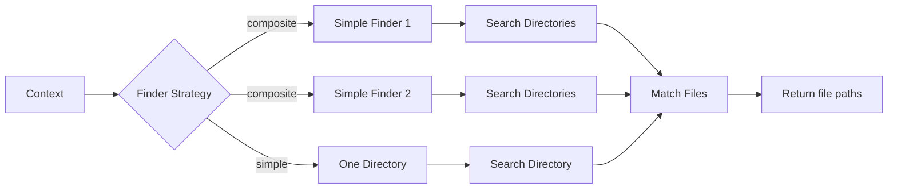
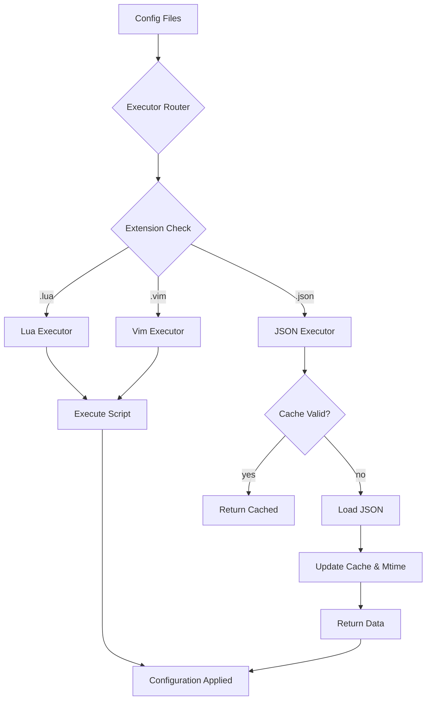

# nvim-project-config

Load project-specific configuration dynamically in Neovim.

## Introduction

`nvim-project-config` automatically discovers your project name and loads configuration from a dedicated directory based on your current working directory. It eliminates manual project switching and provides a consistent, extensible way to manage per-project Neovim settings.

When you open Neovim in `~/src/rad-project/test`, this library:
1. Walks up directories to find your project root (by default, looks for `.git`)
2. Identifies your project name (`rad`)
3. Loads configuration from `~/.config/nvim/projects/rad.lua` (or `.vim`, `.json`)
4. Executes the configuration in your Neovim session

## Architecture

The library follows a three-stage pipeline: **Discovery → Finding → Execution**. Each stage is pluggable and configurable.


## Configuration

```lua
require('nvim-project-config').setup({
  -- Project Discovery Configuration
  project_discovery = {
    -- Strategy to find project root and extract name
    strategy = function(cwd)
      -- Default: walk up looking for .git, extract name from parent directory
      local path = require('plenary.path')
      local current = path:new(cwd)
      
      while current.filename ~= '/' do
        if current:joinpath('.git'):exists() then
          return current.filename
        end
        current = current:parent()
      end
      
      return vim.fn.fnamemodify(cwd, ':t')
    end,
    
    -- Alternative: use matchers
    matchers = {
      {
        find = '.git',
        extract_name = function(dir)
          return require('plenary.path'):new(dir):parent().filename
        end
      }
    }
  },
  
  -- Configuration Directory
  config_dir = function()
    return vim.fn.stdpath('config') .. '/projects'
  end,
  
  -- Configuration Finding
  finder = {
    -- Composite finder runs multiple simple finders
    strategy = 'composite',
    
    -- Simple finder configuration
    simple = {
      -- File patterns to match
      matchers = function(context)
        return {
          context.project_name .. '.lua',
          context.project_name .. '.vim',
          context.project_name .. '.json'
        }
      end,
      
      -- Directories to search
      directories = function(context)
        return {
          '.',  -- Current project config directory
          context.project_name  -- Subdirectory named after project
        }
      end
    }
  },
  
  -- Execution Configuration
  executor = {
    -- Composite executor delegates to format-specific executors
    strategy = 'composite',
    
    -- Executor routing based on file extension
    routes = {
      ['\.lua$'] = 'lua',
      ['\.vim$'] = 'vim',
      ['\.json$'] = 'json'
    },
    
    -- Specific executor configurations
    executors = {
      lua = {
        type = 'script',
        cache = false
      },
      vim = {
        type = 'script',
        cache = false
      },
      json = {
        type = 'json',
        cache = true,
        -- Check file mtime before using cache
        validate_cache = function(file_path, cached_data)
          local stat = vim.loop.fs_stat(file_path)
          if not stat then return false end
          return cached_data._mtime == stat.mtime.sec
        end
      }
    }
  }
})
```

### Configuration Details

All configuration values accept either a direct value or a function that returns the value. This provides maximum flexibility for dynamic configuration.

#### Matchers

Matchers are flexible building blocks that can be:
- A string (exact match)
- A pattern string (matched with `vim.regex`)
- A function returning boolean
- A table with `find` and `extract_name` functions

```lua
-- String matcher
matcher = '.git'

-- Pattern matcher  
matcher = '.*%.git$'

-- Function matcher
matcher = function(dir)
  return vim.fn.isdirectory(dir .. '/.git') == 1
end

-- Table matcher with extraction logic
matcher = {
  find = function(dir)
    return vim.fn.filereadable(dir .. '/package.json') == 1
  end,
  extract_name = function(dir)
    local json = vim.fn.json_decode(vim.fn.readfile(dir .. '/package.json'))
    return json.name
  end
}
```

## File Structure

```
nvim-project-config/
├── lua/nvim-project-config/
│   ├── init.lua                 -- Main entry point
│   ├── config.lua               -- Configuration validation and defaults
│   ├── context.lua              -- Context object management
│   ├── discoverer/
│   │   ├── init.lua            -- Dispatcher for discovery strategies
│   │   ├── matcher.lua         -- Matcher utilities
│   │   └── strategies/
│   │       ├── composite.lua   -- Composite discovery strategy
│   │       └── simple.lua      -- Simple directory walking
│   ├── finder/
│   │   ├── init.lua            -- Dispatcher for finder strategies
│   │   └── strategies/
│   │       ├── composite.lua   -- Composite finder (runs multiple)
│   │       └── simple.lua      -- Simple finder (one directory)
│   └── executor/
│       ├── init.lua            -- Dispatcher for executors
│       ├── cache.lua           -- Caching layer with mtime validation
│       └── strategies/
│           ├── composite.lua   -- Routes by extension
│           ├── script.lua        -- Lua/Vim script execution
│           └── json.lua        -- JSON settings with cache
├── tests/
│   ├── discoverer_spec.lua
│   ├── finder_spec.lua
│   └── executor_spec.lua
└── README.md
```

## Detailed Architecture

### Stage 1: Project Discovery

```mermaid
graph TD
    A[cwd] --> B{Strategy}
    B -->|composite| C[Matcher 1]
    B -->|composite| D[Matcher 2]
    B -->|composite| E[Matcher 3]
    B -->|simple| F[Walk Directories]
    
    C --> G{Match?}
    D --> H{Match?}
    E --> I{Match?}
    F --> J[Extract Name]
    
    G -->|yes| K[Return context]
    H -->|yes| K
    I -->|yes| K
    J --> K
    
    K --> L[context: {project_name, config_dir}]
```

**Project Discovery** determines which project you're working in. It receives the current working directory and returns a context object containing:
- `project_name`: The extracted project name
- `config_dir`: The base configuration directory

The default strategy is **composite**, trying multiple matchers until one succeeds. Each matcher can be:
- A git repository detector (looks for `.git` folder)
- A language-specific detector (looks for `package.json`, `go.mod`, etc.)
- A custom function

### Stage 2: Configuration Finding



**Configuration Finding** locates configuration files to execute. It receives the context and returns a list of file paths. The default **composite finder**:
1. Searches the config directory root for `project_name.{lua,vim,json}`
2. Searches the `project_name/` subdirectory for any matching files

File matching uses configurable patterns that support:
- Exact filenames
- Extensions
- Custom matching functions

### Stage 3: Execution



**Execution** runs the found configuration files. The **composite executor** routes files to format-specific executors based on extension:

- **Lua/Vim Executors**: Execute as scripts in the Neovim environment
- **JSON Executor**: Loads settings with intelligent caching:
  - On first load: Read file, store content + mtime
  - On subsequent access: Check current mtime vs cached mtime
  - If changed: Reload file, update cache
  - If mtime unavailable: Assume dirty cache (fail-safe)

The caching mechanism prevents repeated disk I/O while ensuring consistency when files change outside of Neovim.

### Matcher System

Match patterns are unified across all stages:

```lua
-- Single value
local matcher = '*.lua'

-- Multiple values  
local matchers = { '*.lua', '*.vim' }

-- Mixed: strings and functions
local matchers = {
  '*.lua',
  function(path) return path:match('%.vim$') end,
  { pattern = '.*%.json$', case_sensitive = false }
}
```

This pattern provides maximum flexibility while maintaining a consistent API surface.

## Usage

### Basic Setup

```lua
require('nvim-project-config').setup()
```

This enables all default behaviors:
- Walk up directories looking for `.git`
- Load config from `~/.config/nvim/projects/{project_name}.{lua,vim,json}`
- Execute configuration automatically

### Project-Specific Configuration

Create `~/.config/nvim/projects/my-project.lua`:

```lua
-- This runs in Neovim's Lua environment
vim.opt.shiftwidth = 2
vim.opt.tabstop = 2

-- Project-specific keymaps
vim.keymap.set('n', '<leader>rt', function()
  require('plenary.job'):new({
    command = 'npm',
    args = { 'test' },
    cwd = vim.fn.getcwd()
  }):sync()
end)
```

JSON configuration provides programmatic access:

```json
{
  "settings": {
    "shiftwidth": 2,
    "tabstop": 2
  },
  "commands": {
    "test": "npm test",
    "build": "npm run build"
  }
}
```

Access JSON config programmatically:

```lua
local project_config = require('nvim-project-config')
local config = project_config.get_json('my-project')

if config then
  vim.opt.shiftwidth = config.settings.shiftwidth
  
  -- Create commands from JSON
  vim.api.nvim_create_user_command('ProjectTest', function()
    vim.fn.system(config.commands.test)
  end, {})
end
```

### Custom Discovery

Detect projects by `package.json`:

```lua
require('nvim-project-config').setup({
  project_discovery = {
    matchers = {
      {
        find = 'package.json',
        extract_name = function(dir)
          local file = dir .. '/package.json'
          local content = vim.fn.readfile(file)
          local json = vim.fn.json_decode(content)
          return json.name or vim.fn.fnamemodify(dir, ':t')
        end
      }
    }
  }
})
```

### Advanced Configuration

Custom finder and executor:

```lua
require('nvim-project-config').setup({
  finder = {
    strategy = function(context)
      -- Custom finder logic
      local scan = require('plenary.scandir')
      return scan.scan_dir(context.config_dir, {
        search_pattern = context.project_name .. '.*'
      })
    end
  },
  
  executor = {
    routes = {
      ['_spec%.lua$'] = 'test-runner',  -- Run tests differently
      ['%.lua$'] = 'lua'
    },
    executors = {
      ['test-runner'] = {
        type = 'custom',
        run = function(file_path)
          -- Custom execution logic
          require('plenary.test_harness'):test_file(file_path)
        end
      }
    }
  }
})
```

## API

### Main Module

```lua
-- Setup with optional configuration
grequire('nvim-project-config').setup(opts: table)

-- Manually trigger project detection and config loading
require('nvim-project-config').load()

-- Get JSON configuration for a project
require('nvim-project-config').get_json(project_name: string): table|nil

-- Clear all caches
require('nvim-project-config').clear_cache()
```

### Context Object

The context object flows through all stages:

```lua
{
  project_name = "rad-project",
  config_dir = "/home/user/.config/nvim/projects",
  cwd = "/home/user/src/rad-project/test"
}
```

All strategies and executors receive this context and can augment it.

## Extending

### Custom Discovery Strategy

```lua
local M = {}

function M.new(config)
  return setmetatable({ config = config }, { __index = M })
end

function M:execute(context)
  -- Implement discovery logic
  -- Return updated context with project_name
  return vim.tbl_extend('force', context, {
    project_name = self:extract_project_name(context.cwd)
  })
end

return M
```

### Custom Executor

```lua
local M = {}

function M.new(config)
  return setmetatable({ config = config }, { __index = M })
end

function M:execute(context, files)
  for _, file in ipairs(files) do
    if file:match('%.yaml$') then
      self:load_yaml(file)
    end
  end
end

return M
```

## Performance

- Asynchronous execution using `plenary.async`
- Intelligent caching with mtime validation
- Configurable cache TTL for JSON settings
- Minimal blocking during startup

## Requirements

- Neovim 0.8+
- plenary.nvim

## Installation

```lua
-- Using lazy.nvim
{
  'rektide/nvim-project-config',
  dependencies = { 'nvim-lua/plenary.nvim' },
  config = function()
    require('nvim-project-config').setup()
  end
}
```

## License

MIT