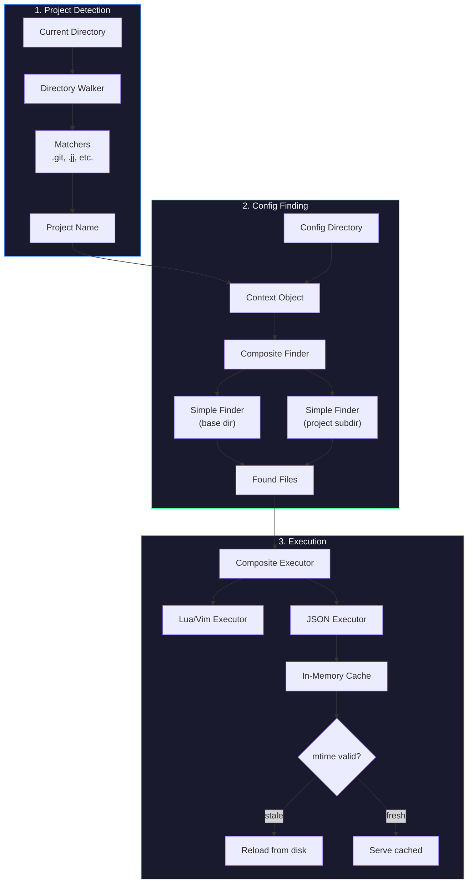
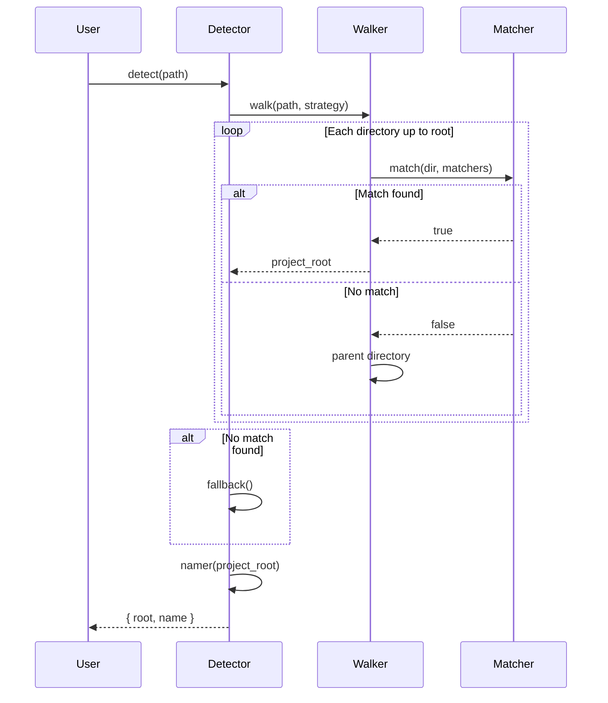
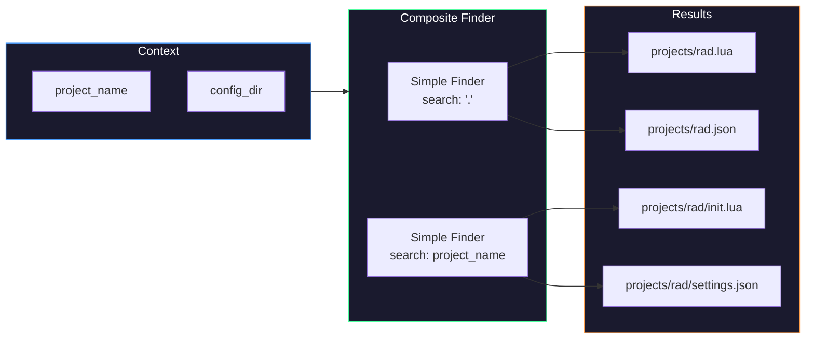
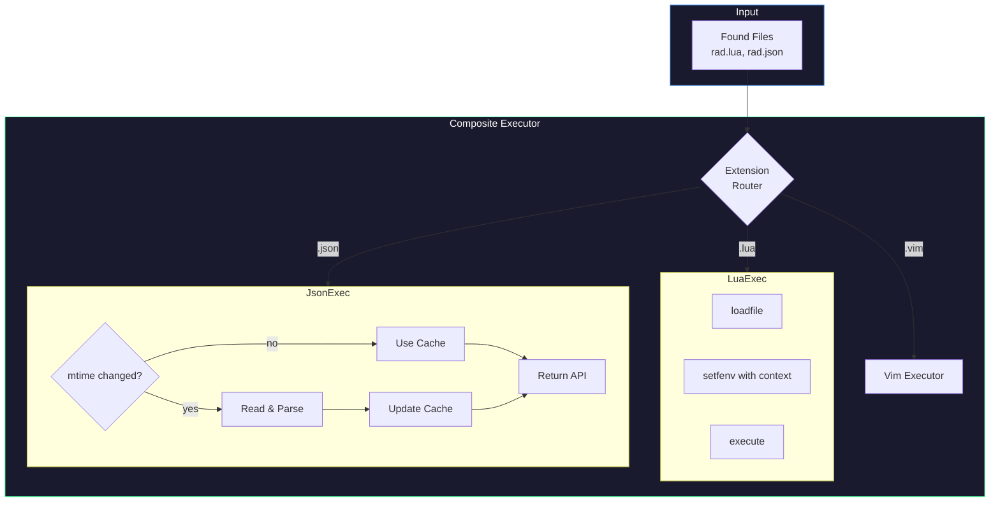

# nvim-project-config

Load Neovim configuration automatically based on your current project.

## Table of Contents

- [Introduction](#introduction)
- [Architecture Overview](#architecture-overview)
- [Installation](#installation)
- [Configuration](#configuration)
- [File Structure](#file-structure)
- [Architecture Details](#architecture-details)
- [API Reference](#api-reference)

## Introduction

Working across multiple projects often means juggling different coding styles, LSP settings, formatters, and keybindings. `nvim-project-config` solves this by automatically detecting your current project and loading project-specific configuration—whether that's Lua scripts, Vimscript, or JSON settings.

When you open a file in `~/src/rad-project/test/foo.lua`, the plugin:

1. **Detects** the project root by walking up directories looking for markers (`.git`, `.jj`, etc.)
2. **Finds** configuration files in your config directory (e.g., `~/.config/nvim/projects/rad-project/`)
3. **Executes** those configurations—running Lua/Vim scripts and loading JSON settings into a queryable cache

Everything is async, composable, and configurable.

## Architecture Overview



## Installation

Using lazy.nvim:

```lua
{
  "rektide/nvim-project-config",
  dependencies = { "nvim-lua/plenary.nvim" },
  config = function()
    require("nvim-project-config").setup()
  end,
}
```

## Configuration

### Quick Start

Zero-config works out of the box:

```lua
require("nvim-project-config").setup()
```

Then create `~/.config/nvim/projects/my-project.lua` and it runs when you're in a `my-project` directory.

### Default Configuration (Fully Elaborated)

```lua
require("nvim-project-config").setup({
  -- Stage 1: Project Detection
  detector = {
    -- How to walk directories; "up" walks toward root
    strategy = "up",

    -- Matchers determine what marks a project root
    -- Can be: string | function | (string | function)[]
    matchers = {
      ".git",
      ".jj",
      -- function(path) return vim.fn.isdirectory(path .. "/node_modules") == 1 end,
    },

    -- Fallback when no match found
    fallback = function()
      return vim.fn.getcwd()
    end,

    -- Extract project name from detected root
    -- string "basename" | function(root_path) -> string
    namer = "basename",
  },

  -- Stage 2: Config Finding
  finder = {
    -- Base config directory
    -- string | function() -> string
    config_dir = function()
      return vim.fn.stdpath("config") .. "/projects"
    end,

    -- The finder function itself
    -- function(context) -> string[]
    find = function(context)
      -- Default: composite of two simple finders
      local simple = require("nvim-project-config.finder").simple
      local files = {}

      -- Find in base config dir (e.g., projects/my-project.lua)
      vim.list_extend(files, simple(context, "."))

      -- Find in project subdir (e.g., projects/my-project/init.lua)
      vim.list_extend(files, simple(context, context.project_name))

      return files
    end,

    -- File name matching for simple finder
    -- string | function | (string | function)[]
    file_matchers = {
      -- Matches: <project>.lua, <project>.vim, <project>.json
      function(filename, context)
        local base = context.project_name
        return filename == base .. ".lua"
            or filename == base .. ".vim"
            or filename == base .. ".json"
      end,
      -- Also match init files in subdirectory
      function(filename, _)
        return filename == "init.lua"
            or filename == "init.vim"
            or filename == "settings.json"
      end,
    },
  },

  -- Stage 3: Execution
  executor = {
    -- The executor function
    -- function(context, files) -> void
    execute = nil, -- uses default composite executor

    -- Extension-to-executor mapping
    -- Keys: extension string
    -- Values: string | function | (string | function)[]
    handlers = {
      lua = "lua",           -- built-in lua executor
      vim = "vim",           -- built-in vim executor
      json = "json",         -- built-in json executor (caches)
    },

    -- JSON executor settings
    json = {
      -- Check mtime before reads/writes
      check_mtime = true,

      -- Fallback if mtime detection fails
      assume_dirty = true,
    },
  },

  -- General settings
  async = true,              -- Use plenary.async for all operations
  auto_load = true,          -- Load on VimEnter and DirChanged
  cache_detection = true,    -- Cache project detection per directory
})
```

### Matcher Flexibility

Throughout the configuration, matchers follow a consistent pattern—they can be:

| Form | Example |
|------|---------|
| String (exact match) | `".git"` |
| String (glob pattern) | `"*.workspace"` |
| Function | `function(path) return vim.fn.filereadable(path .. "/Cargo.toml") == 1 end` |
| List of any above | `{ ".git", ".jj", function(p) ... end }` |

```lua
-- All equivalent for simple cases:
matchers = ".git"
matchers = { ".git" }
matchers = function(path) return vim.fn.isdirectory(path .. "/.git") == 1 end

-- Complex matching:
matchers = {
  ".git",
  ".jj",
  function(path)
    -- Rust workspace root
    return vim.fn.filereadable(path .. "/Cargo.toml") == 1
  end,
  "*.code-workspace", -- glob pattern
}
```

### Configuration Recipes

**Per-language project configs:**

```lua
finder = {
  file_matchers = function(filename, context)
    -- Match by filetype too
    return filename:match(context.project_name)
        or filename:match(vim.bo.filetype)
  end,
}
```

**XDG-compliant separate config:**

```lua
finder = {
  config_dir = function()
    return (os.getenv("XDG_CONFIG_HOME") or os.getenv("HOME") .. "/.config")
      .. "/nvim-projects"
  end,
}
```

**Monorepo support:**

```lua
detector = {
  matchers = {
    function(path)
      -- Check for workspace-level marker
      return vim.fn.filereadable(path .. "/pnpm-workspace.yaml") == 1
    end,
  },
  namer = function(root)
    -- Use parent + child for monorepo packages
    local parent = vim.fn.fnamemodify(root, ":h:t")
    local child = vim.fn.fnamemodify(root, ":t")
    return parent .. "-" .. child
  end,
}
```

## File Structure

```
nvim-project-config/
├── lua/
│   └── nvim-project-config/
│       ├── init.lua              # Entry point, setup()
│       ├── config.lua            # Default config & merging
│       ├── context.lua           # Context object factory
│       │
│       ├── detector/
│       │   ├── init.lua          # Detector orchestration
│       │   ├── walker.lua        # Directory walking strategies
│       │   ├── matchers.lua      # Built-in matchers
│       │   └── namer.lua         # Project name extraction
│       │
│       ├── finder/
│       │   ├── init.lua          # Finder orchestration
│       │   ├── simple.lua        # Simple single-dir finder
│       │   └── composite.lua     # Combines multiple finders
│       │
│       ├── executor/
│       │   ├── init.lua          # Executor orchestration
│       │   ├── lua.lua           # Lua file executor
│       │   ├── vim.lua           # Vimscript executor
│       │   ├── json.lua          # JSON loader with cache
│       │   └── composite.lua     # Routes by extension
│       │
│       └── util/
│           ├── async.lua         # Plenary.async helpers
│           ├── matcher.lua       # Normalize matcher input
│           ├── mtime.lua         # File modification tracking
│           └── cache.lua         # General caching utilities
│
├── doc/
│   └── nvim-project-config.txt   # Vim help documentation
│
└── plugin/
    └── nvim-project-config.lua   # Auto-commands setup
```

## Architecture Details

### Stage 1: Project Detection



The **Walker** implements traversal strategies:
- `"up"` (default): Walk from current directory toward filesystem root
- `"down"`: Walk from a known root downward (for monorepos)
- Custom function for complex cases

**Matchers** are normalized via `util.matcher` to always become `function(path) -> boolean`. Detection results are cached per-directory when `cache_detection = true`.

### Stage 2: Config Finding



The **Simple Finder** takes the context plus a relative search path:
1. Resolves `config_dir/search_path`
2. Lists files in that directory
3. Filters using `file_matchers`
4. Returns absolute paths of matches

The **Composite Finder** runs multiple simple finders and concatenates results, enabling both flat (`projects/rad.lua`) and nested (`projects/rad/init.lua`) organization.

### Stage 3: Execution



**Lua Executor**: Loads and executes Lua files, injecting the context object as a global.

**Vim Executor**: Sources Vimscript files via `vim.cmd.source()`.

**JSON Executor**: Maintains an in-memory cache with mtime validation:

```lua
-- In your project config, access JSON settings:
local settings = require("nvim-project-config").json("my-project")

settings:get("formatOnSave")           -- Read a value
settings:set("formatOnSave", true)     -- Write (persists to disk)
settings:get("nested.key.path")        -- Dot-notation access
```

The cache checks file mtime before every read/write. If mtime detection fails (some filesystems), it falls back to `assume_dirty = true` behavior, always re-reading.

## API Reference

```lua
local npc = require("nvim-project-config")

-- Setup with optional config
npc.setup(config?)

-- Manual detection/loading
npc.detect(path?)           -- Returns { root = string, name = string }
npc.load(path?)             -- Detect + find + execute
npc.reload()                -- Force reload current project

-- JSON settings access
npc.json(project_name?)     -- Returns settings API for project

-- Context access
npc.context()               -- Current context object or nil

-- Events (via vim.api.nvim_create_autocmd)
-- "User NvimProjectConfigLoaded"    -- After project config loaded
-- "User NvimProjectConfigDetected"  -- After project detected
```

## License

MIT
